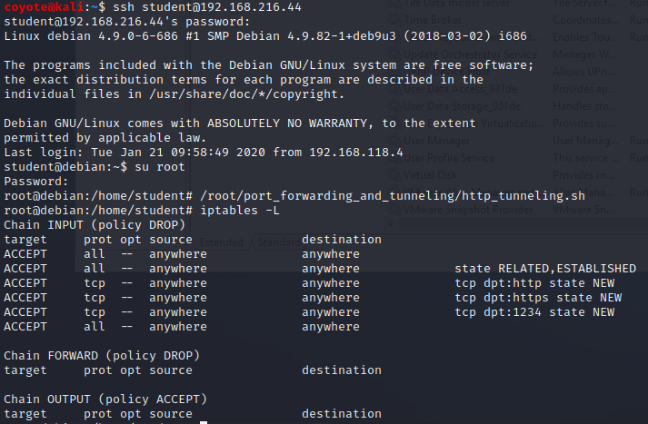
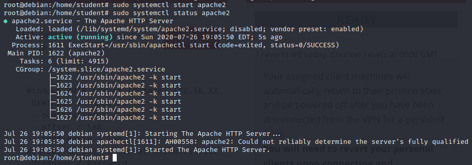
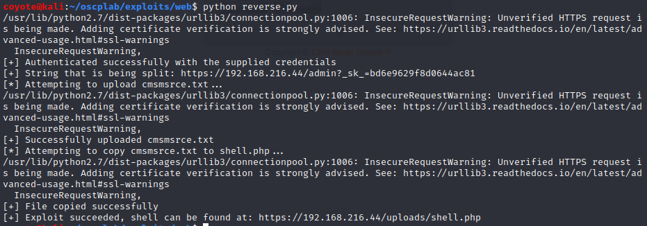
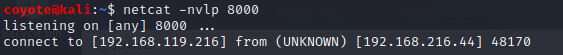
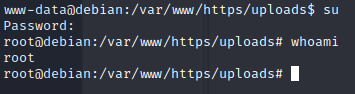
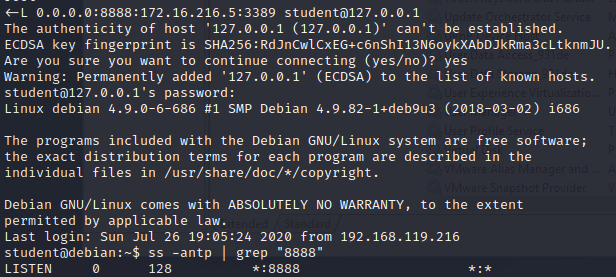
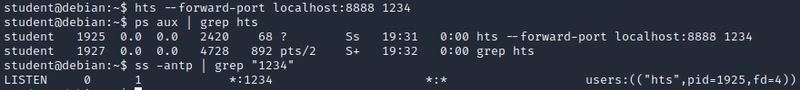
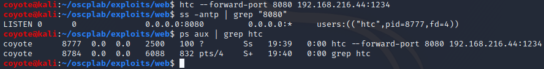
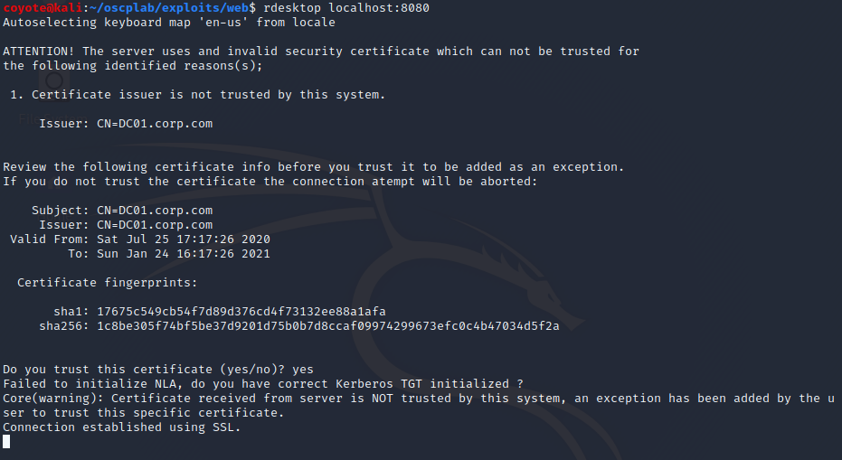
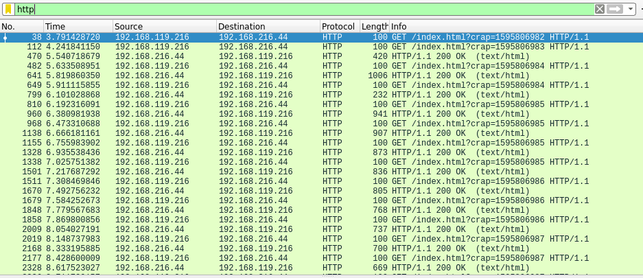

### 20.5.1.1 Exercises
#### 1. Connect to your dedicated Linux lab client as the student account using rdesktop and run the http_tunneling.sh script from /root/port_forwarding_and_tunneling/ as root.



#### 2. Start the apache2 service and exploit the vulnerable web application hosted on port 443 (covered in a previous module) in order to get a reverse HTTP shell.

1. Started Apache2 service
   
   
2. Re-used python code from exercise 15.2.4.1, then visited the created shell code page to get a reverse shell from the CMS Made Simple web app:
   

   

3. Upgraded the shell to a fully interactive shell with this process:

   ```bash
   SHELL=/bin/bash script -q /dev/null
   CTRL+Z
   stty raw -echo
   #After typing the above, you won't see the next thing you type
   fg
   reset
   xterm
   #Press 'ENTER' a couple of times to get the prompt back
   ```

4. Because I have root's password, I switch to the root user:
   

#### 3. Replicate the scenario demonstrated above using your dedicated clients.

1. Using the reverse shell from above, set up an SSH port forward on the Linux Client to the Windows 2016 server and confirm the port is listening:

   ```bash
   ssh -L 0.0.0.0:8888:172.16.216.5:3389 student@127.0.0.1
   ```

   

2. Start the httptunnel server on the Linux Client, setting it to listen using the misconfigured open port 1234 and to forward decapsulated traffic to localhost:8888, which will be caught by our ssh port forward:
   

3. Start the httptunnel client on the Kali machine to have it establish an HTTP tunnel with the Linux client:
   

4. Connected to the Windows 2016 Server using localhost:8080
   

5. Verified the traffic is http encapsulated:
   