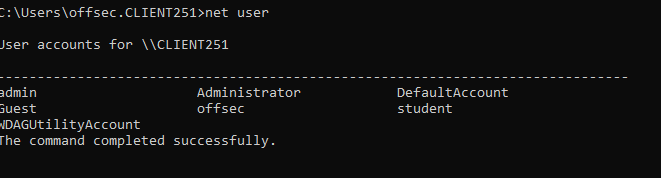
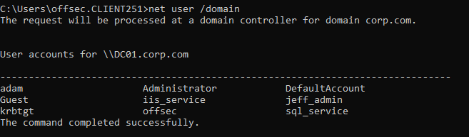
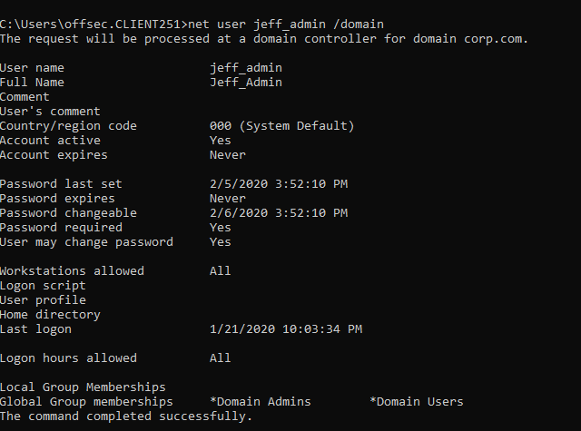
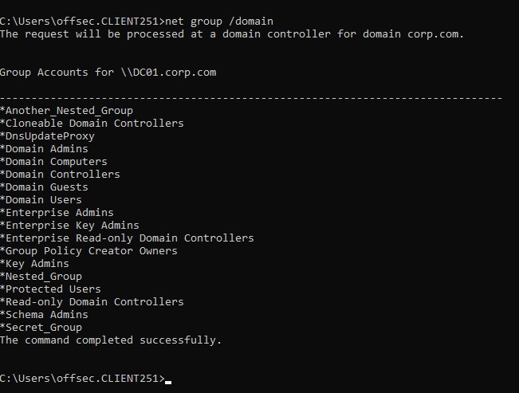

### 21.2.1.1 Exercise
#### 1. Connect to your Windows 10 client and use net.exe to lookup users and groups in the domain. See if you can discover any interesting users or groups.

- Local users
  
- Domain users
  
- Domain admin user:
  
- Domain Groups:
  