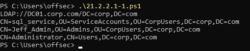
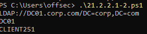
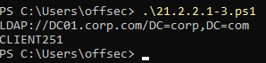

### 21.2.2.1 Exercises
#### 1. Modify the PowerShell script to only return members of the Domain Admins group.

```powershell
$domainObj = [System.DirectoryServices.ActiveDirectory.Domain]::GetCurrentDomain()

$PDC = ($domainObj.PdcRoleOwner).Name

$SearchString = "LDAP://"
$SearchString += $PDC + "/"
$DistinguishedName = "DC=$($domainObj.Name.Replace('.', ',DC='))"
$SearchString += $DistinguishedName
$SearchString

$Searcher = New-Object System.DirectoryServices.DirectorySearcher([ADSI]$SearchString)

$objDomain = New-Object System.DirectoryServices.DirectoryEntry

$Searcher.SearchRoot = $objDomain

$Searcher.filter="(name=Domain Admins)"

$Result = $Searcher.FindAll()

Foreach($obj in $Result)
{
	$obj.Properties.member
}
```



#### 2. Modify the PowerShell script to return all computers in the domain.

```powershell
$domainObj = [System.DirectoryServices.ActiveDirectory.Domain]::GetCurrentDomain()

$PDC = ($domainObj.PdcRoleOwner).Name

$SearchString = "LDAP://"
$SearchString += $PDC + "/"
$DistinguishedName = "DC=$($domainObj.Name.Replace('.', ',DC='))"
$SearchString += $DistinguishedName
$SearchString

$Searcher = New-Object System.DirectoryServices.DirectorySearcher([ADSI]$SearchString)

$objDomain = New-Object System.DirectoryServices.DirectoryEntry

$Searcher.SearchRoot = $objDomain

$Searcher.filter="(objectCategory=computer)"

$Result = $Searcher.FindAll()

Foreach($obj in $Result)
{
	$obj.Properties.name
}
```



#### 3. Add a filter to only return computers running Windows 10.

```powershell
$domainObj = [System.DirectoryServices.ActiveDirectory.Domain]::GetCurrentDomain()

$PDC = ($domainObj.PdcRoleOwner).Name

$SearchString = "LDAP://"
$SearchString += $PDC + "/"
$DistinguishedName = "DC=$($domainObj.Name.Replace('.', ',DC='))"
$SearchString += $DistinguishedName
$SearchString

$Searcher = New-Object System.DirectoryServices.DirectorySearcher([ADSI]$SearchString)

$objDomain = New-Object System.DirectoryServices.DirectoryEntry

$Searcher.SearchRoot = $objDomain

$Searcher.filter="(&(objectCategory=computer)(operatingSystem=*Windows 10*))"

$Result = $Searcher.FindAll()
Foreach($obj in $Result)
{
	$obj.Properties.name
}
```

