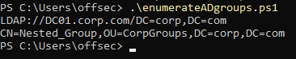
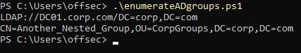
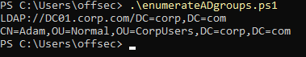
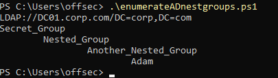

### 21.2.3.1 Exercises
#### 1. Repeat the enumeration to uncover the relationship between Secret_Group, Nested_Group, and Another_Nested_Group.

Used the script below to traverse the group relationships

```powershell
$domainObj = [System.DirectoryServices.ActiveDirectory.Domain]::GetCurrentDomain()

$PDC = ($domainObj.PdcRoleOwner).Name

$SearchString = "LDAP://"
$SearchString += $PDC + "/"
$DistinguishedName = "DC=$($domainObj.Name.Replace('.', ',DC='))"
$SearchString += $DistinguishedName
$SearchString

$Searcher = New-Object System.DirectoryServices.DirectorySearcher([ADSI]$SearchString)

$objDomain = New-Object System.DirectoryServices.DirectoryEntry

$Searcher.SearchRoot = $objDomain

$Searcher.filter="(name=<GROUPNAMEHERE>)"

# Run the search and store in $Results
$Result = $Searcher.FindAll()

# For each object in the results, show the members only
Foreach($obj in $Result)
{
	$obj.Properties.member
}
```

- filter: secret_group, shows it contains the group 'Nested_Group'
  
- filter: Nested_Group, shows it contains the group 'Another_Nested_Group'
  
- filter: Another_Nested_Group, shows it contains the user 'Adam'
  

#### 2. The script presented in this section required us to change the group name at each iteration. Adapt the script in order to unravel nested groups programmatically without knowing their names beforehand.

```powershell
# This script will list members of a given group, then recurse and find nested groups and list their members
$domainObj = [System.DirectoryServices.ActiveDirectory.Domain]::GetCurrentDomain()

$PDC = ($domainObj.PdcRoleOwner).Name

$SearchString = "LDAP://"
$SearchString += $PDC + "/"
$DistinguishedName = "DC=$($domainObj.Name.Replace('.', ',DC='))"
$SearchString += $DistinguishedName
$SearchString

$Searcher = New-Object System.DirectoryServices.DirectorySearcher([ADSI]$SearchString)

$objDomain = New-Object System.DirectoryServices.DirectoryEntry

$Searcher.SearchRoot = $objDomain

$max_depth=10

function NestMembers{
	Param ($GroupName, $depth)
    $Searcher.filter="(name=$GroupName)"
    # Run the search and store in $Results
    $Result = $Searcher.FindAll()	
    Foreach($groupMember in $Result)
    {
        "$('	' * $depth)$($groupMember.Properties.name)"
			if ($groupMember.Properties.member -AND $depth -lt $max_depth)
			{
                Foreach($child in $groupMember.Properties.member)
                {
					$childName=($child.substring(3) -split ',')[0]
					NestMembers $childName ($depth + 1)
                }
			}
    }
}

NestMembers secret_group 0
```



Thanks to [OS-73236](https://forums.offensive-security.com/showthread.php?30595-21-2-3-1-2-Powershell-Scripting) for helping me understand the objects and giving me ideas on this.