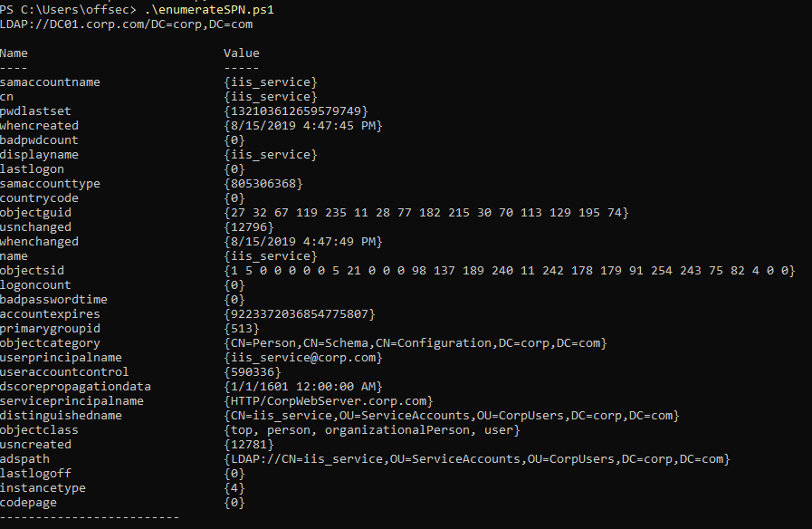
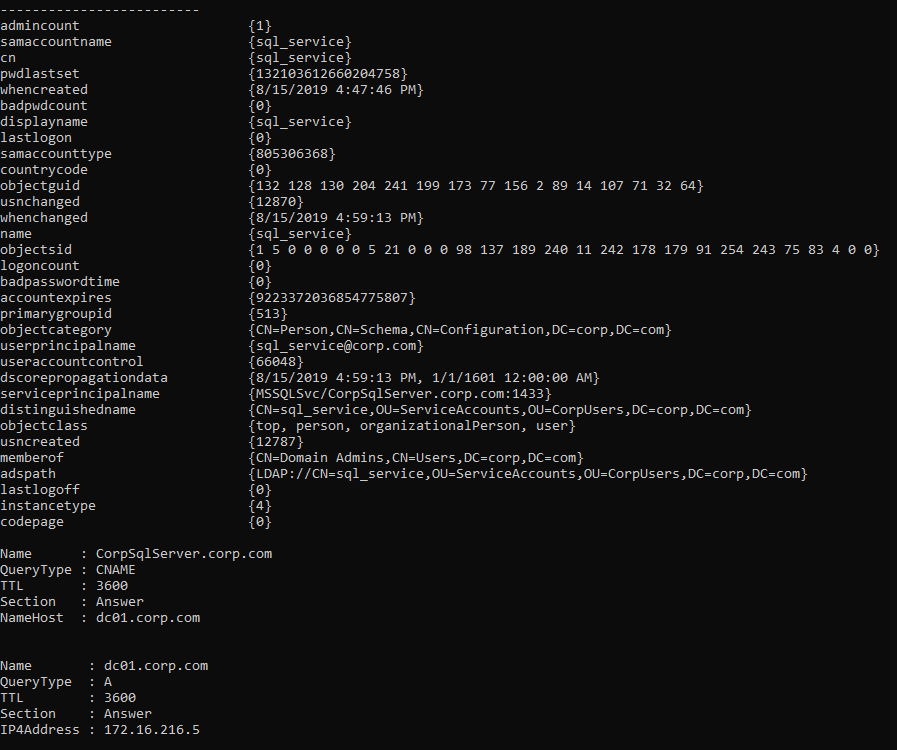
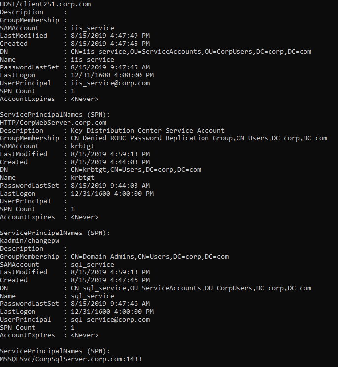

### 21.2.5.2 Exercises
#### 1. Repeat the steps from this section to discover the service principal name for the IIS server.

Updated code from 21.2.3.1 and changed the filter and results loop at the end:

```powershell
$Searcher.filter="serviceprincipalname=*http*"

# Run the search and store in $Results
$Result = $Searcher.FindAll()
Foreach($obj in $Result)
{
	Foreach($prop in $obj.Properties)
	{
		$prop
	}
	
	Write-Host "-------------------------"
}
```



#### 2. Discover any additional registered service principal names in the domain.

Changed filter to `$Searcher.filter="serviceprincipalname=*"` to get these results:

- The DC & Client both showed up
- Kerberos service - kadmin/changepw
- A SQL Service - corpsqlserver.corp.com

#### 3. Update the script so the result includes the IP address of any servers where a service principal name is registered.

Modified the end of the code, it's not perfect, but it works.

```powershell
$Searcher.filter="serviceprincipalname=*"

# Run the search and store in $Results
$Result = $Searcher.FindAll()
Foreach($obj in $Result)
{
	Foreach($prop in $obj.Properties)
	{
		$prop
		Foreach($hostName in ((($prop.serviceprincipalname -split "/")[1]) -split ":")[0])
        {
        	Resolve-DnsName -Name $hostName
        }
	}
	
	Write-Host "-------------------------"
}
```



#### 4. Use the Get-SPN script and rediscover the same service principal names.

```powershell
. ./Get-SPN.ps1
Get-SPN -type service -search *
```

