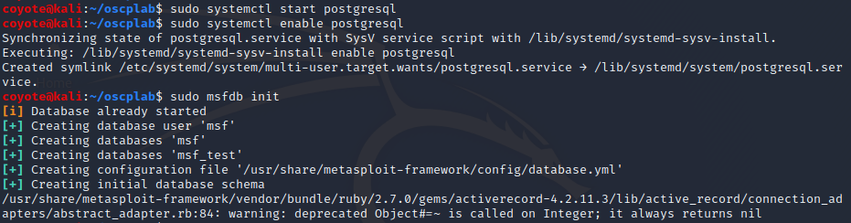
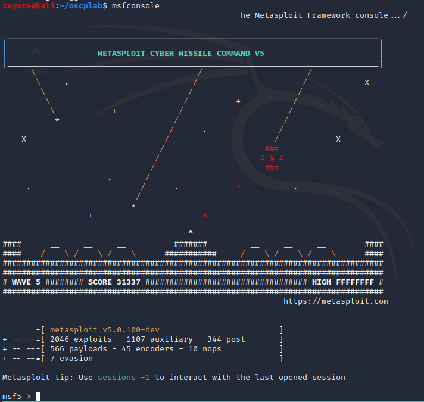
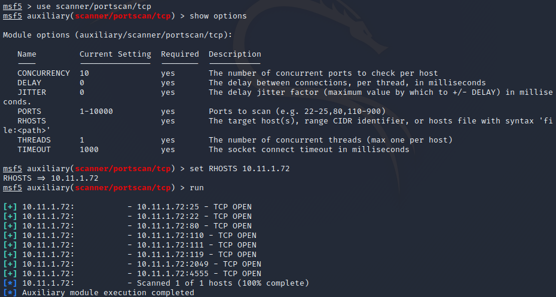
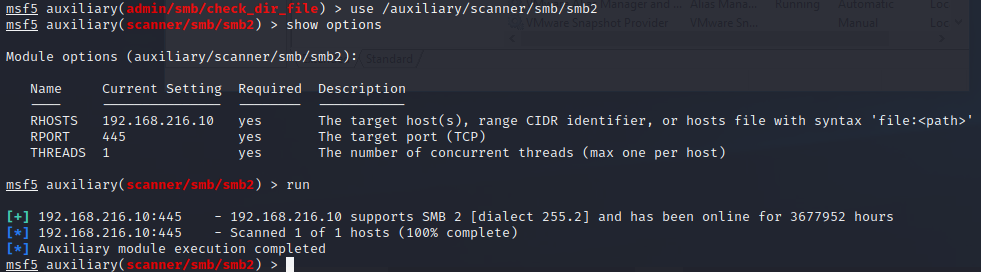
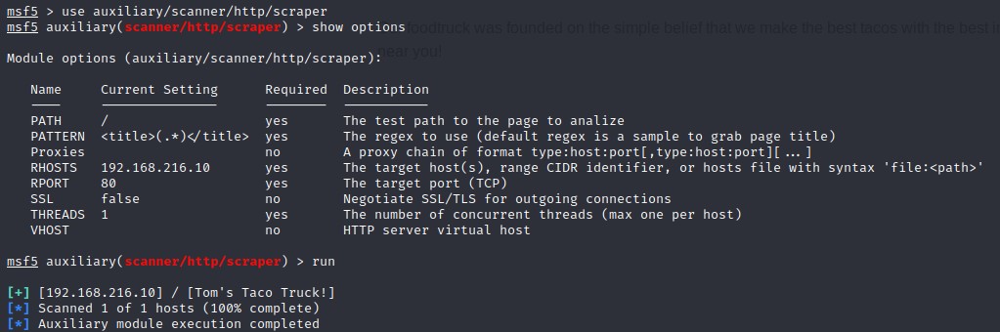
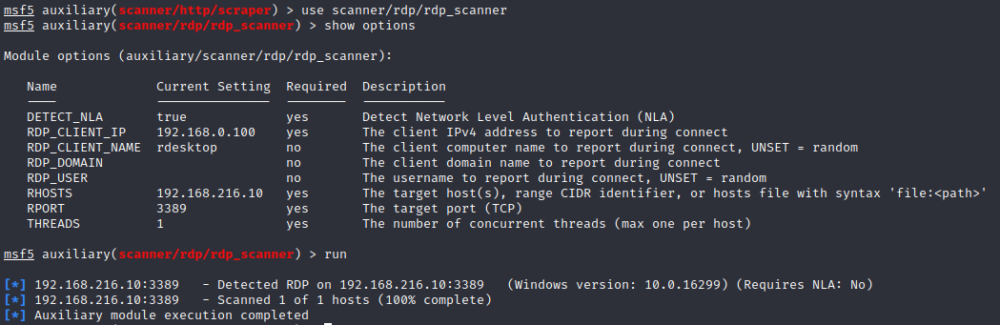
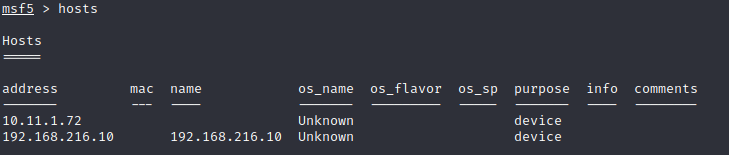

### 22.1.3.1 Exercises
#### 1. Start the postgresql service and launch msfconsole.

#### 2. Use the SMB, HTTP, and any other interesting auxiliary modules to scan the lab systems.

- TCP Scan of 10.11.1.72
  
- /auxiliary/scanner/smb/smb2 on Win10 Host
  
- auxiliary/scanner/http/scraper on Win10 + XAMPP
  
- scanner/rdp/rdp_scanner on Win10
  

#### 3. Review the hosts’ information in the database.

