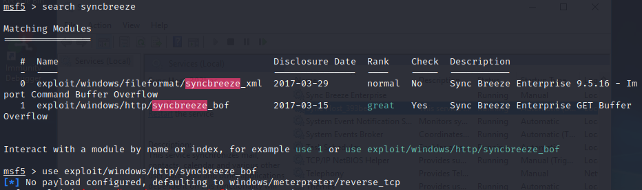
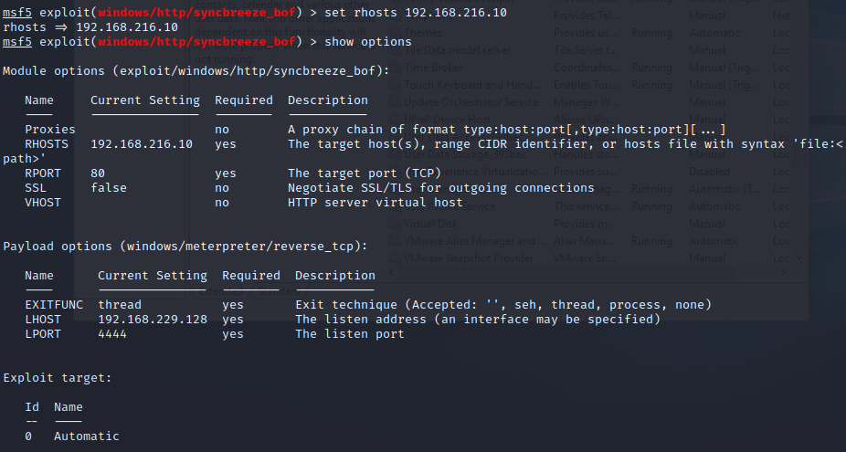
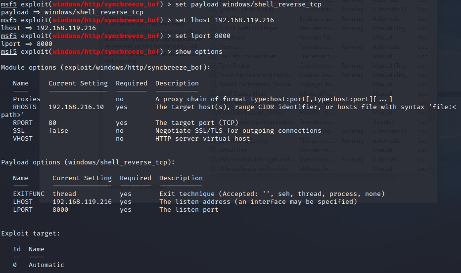
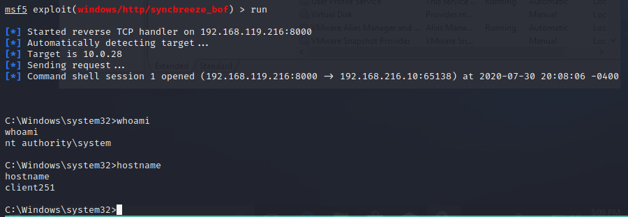

### 22.2.1.1 Exercise
#### 1. Exploit SyncBreeze using the existing Metasploit module.

1. Find and select the proper exploit:
   
2. Set the RHOST to Windows 10
   
3. Set the payload to shell_reverse_tcp & set options:
   
4. Run the exploit to get a reverse shell
   