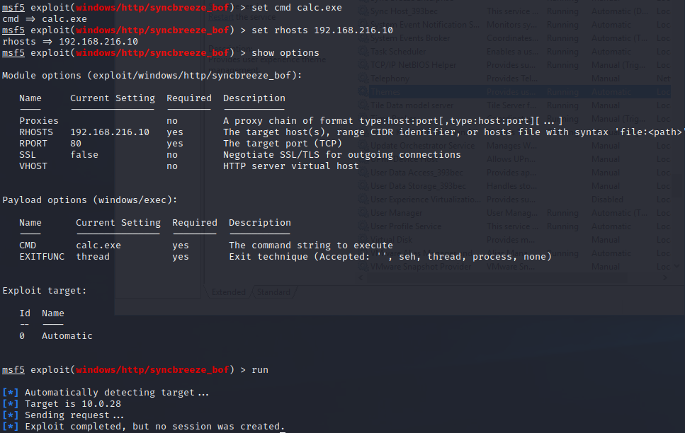
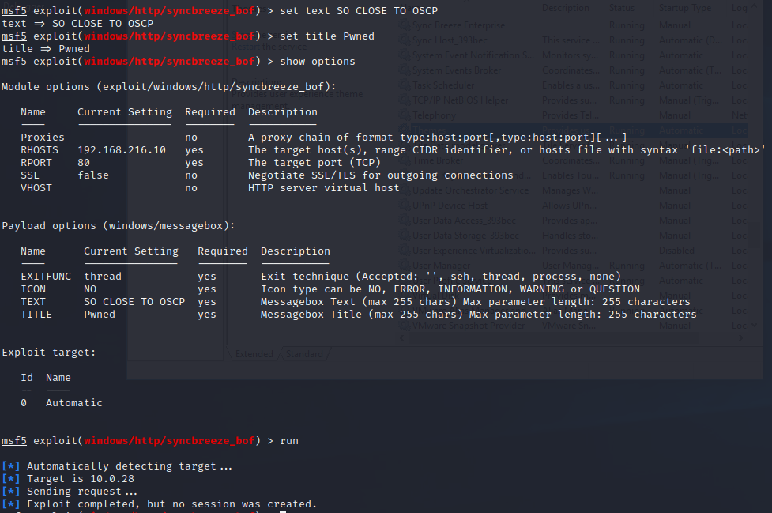
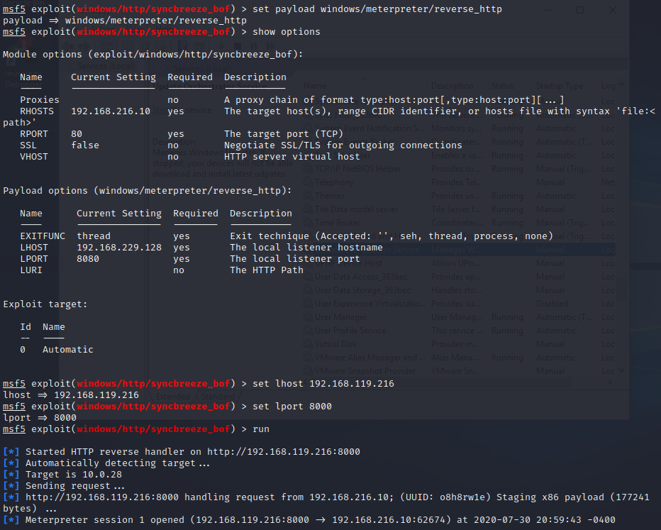
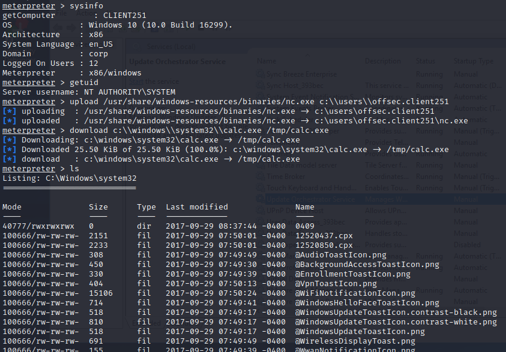

### 22.3.3.2 Exercise
#### 1. Take time to review and experiment with the various payloads available in Metasploit.

Using syncbreeze exploit with Win10 client, I tried several payloads but they didn't seem to work with this exploit.

- windows/exec
  
- windows/messagebox
  
- Meterpreter
  
- More Meterpreter
  
  

