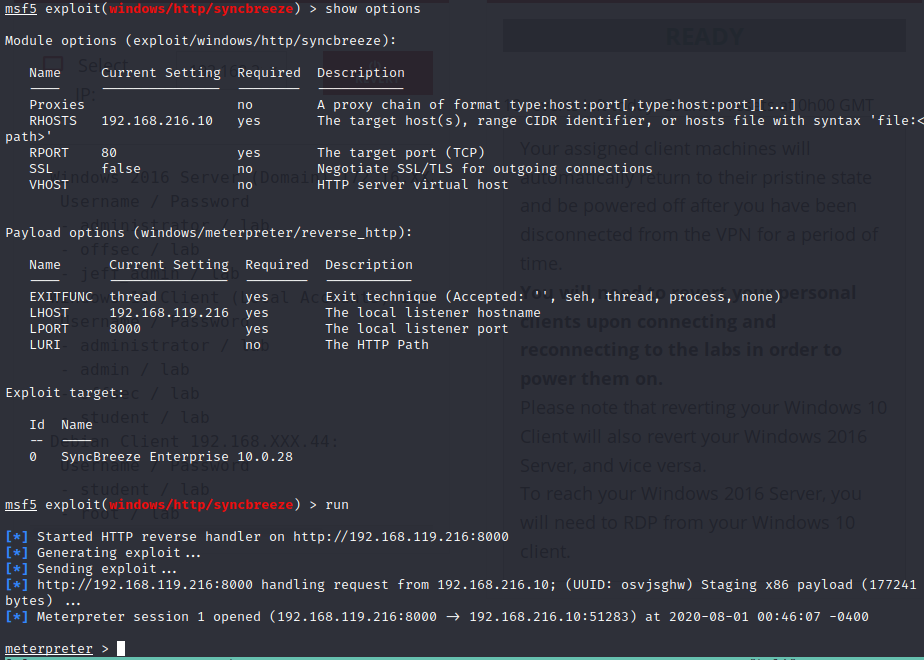
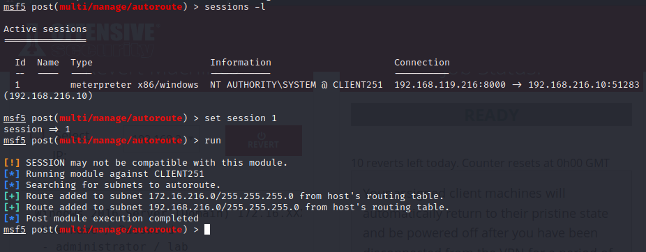
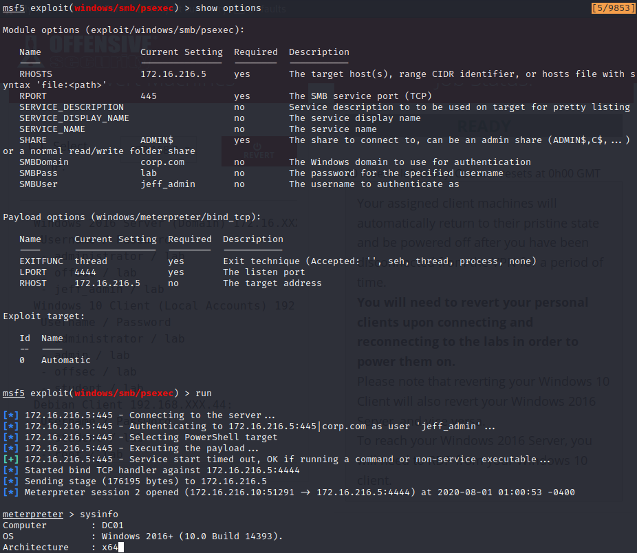
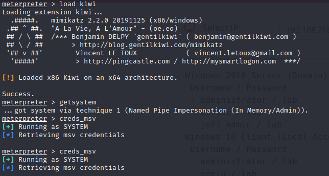
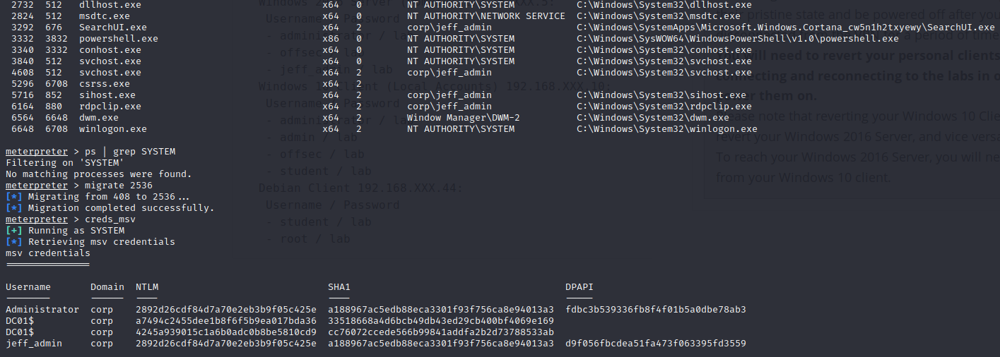

### 22.5.4.1 Exercise
#### 1. Use post-exploitation modules and extensions along with pivoting techniques to enumerate and compromise the domain controller from a meterpreter shell obtained from your Windows 10 client.

1. Used syncbreeze exploit to obtain a Meterpreter shell to Windows 10
   

2. Use the Autoroute module to grab routes from the Win10 meterpreter session
   

3. Used previously obtained `jeff_admin/lab` credentials and psexec to start a meterpreter prompt to DC01 via the route through the Win10 host using a bind shell with  `windows/meterpreter/bind_tcp` since the DC does not have a route to Kali:

   

4. Loaded mimikatz and tried to dump the credentials, but didn't get any results:
   

5. I checked the processes and found one with SYSTEM level privileges, migrated the meterpreter session to it and reran the mimkatz dump to get the hashes:
   

