### 23.3.1.1 Exercises
#### 1. Set up a PowerShell Empire listener and stager and obtain a working agent.

Followed the same steps as in 23.1.3.1-2

1. Started Listener
   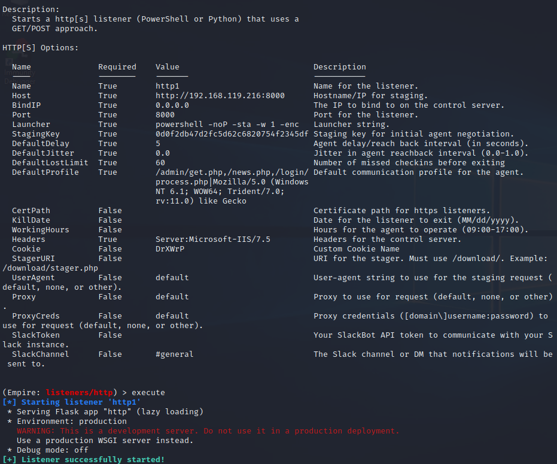
2. Created stager & sent to Windows
   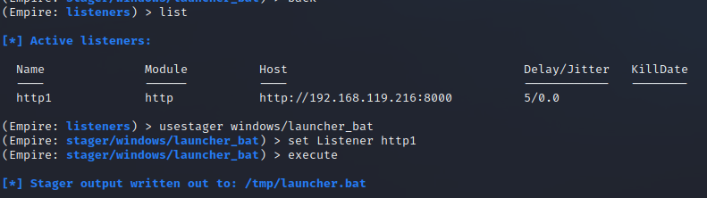
   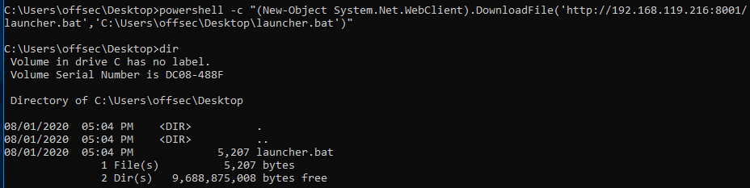
3. Launched stager on Windows to upload agent and initiate connection
   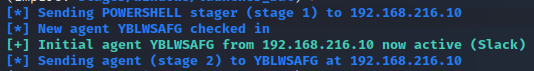
   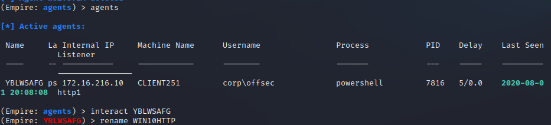

#### 2. Perform enumeration on the domain using various modules.

- powershell/situational_awareness/network/powerview/get_user
  

- powershell/situational_awareness/
  host/antivirusproduct
  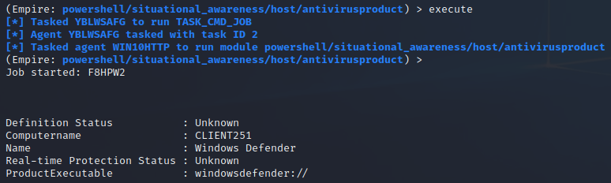

- powershell/situational_awareness/network/powerview/get_domain_controller
  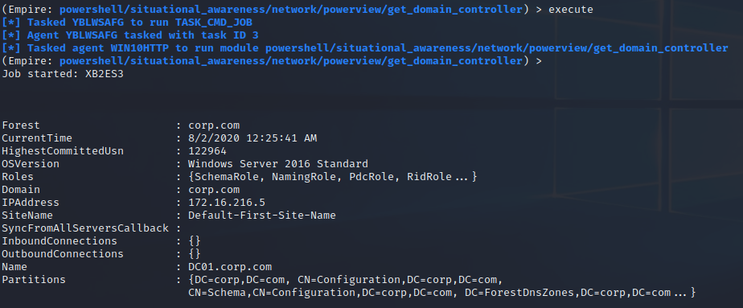

- powershell/situational_awareness/network/powerview/share_finder
  I thought this one was stuck for a minute....

  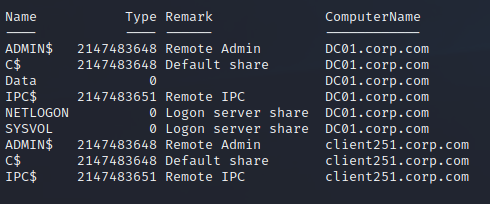

- powershell/situational_awareness/network/powerview/get_ou
  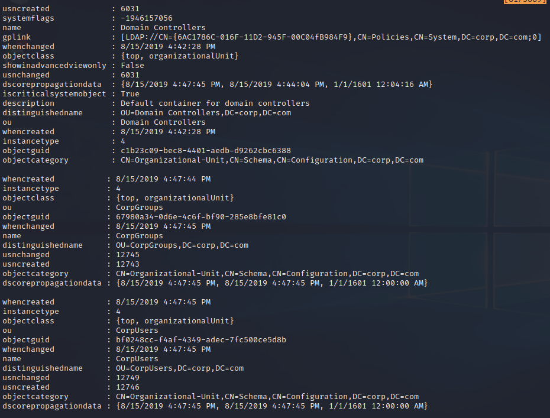

#### 3. Perform a remote desktop login with the account Jeff_Admin to ensure the credentials are cached on the Windows 10 client and then dump the credentials using PowerShell Empire.

1. Logged into Win10 with Jeff_Admin through RDP

2. Escalated privileges to start an agent with high integrity:

   ```bash
   usemodule powershell/privesc/bypassuac_fodhelper
   set Listener http1
   ```

   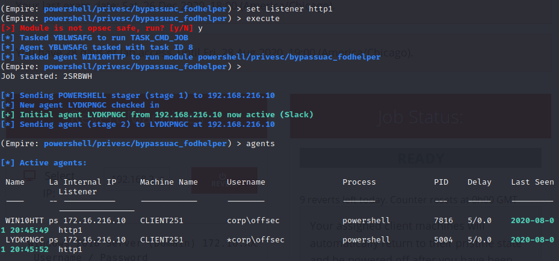

3. Switched to the high integrity agent session, used the Mimikatz LogonPasswords module to dump passwords, then checked the stored creds:
   
   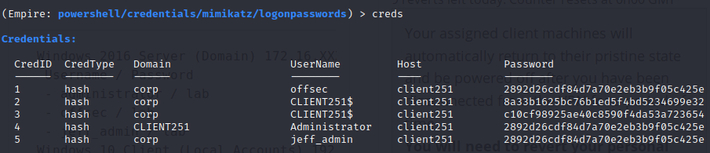

#### 4. Experiment with the different lateral movement modules.

- powershell/lateral_movement/invoke_smbexec
  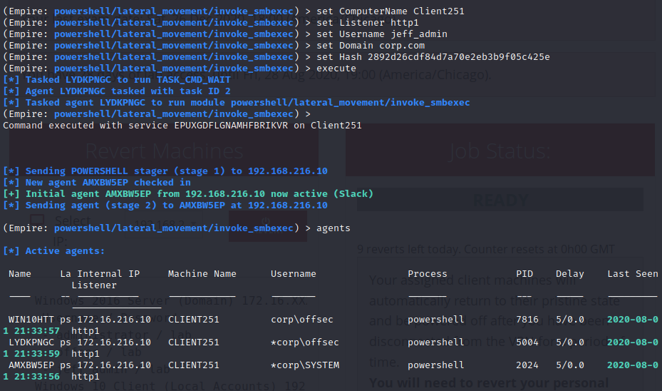
- powershell/lateral_movement/invoke_psexec: Failed
  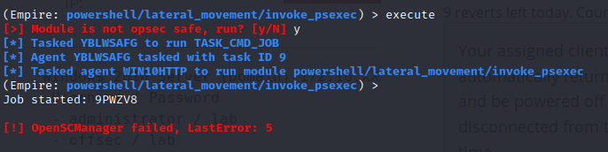