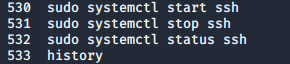
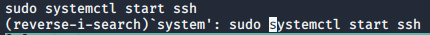

### 3.1.3.2 Exercises
#### 1. Inspect your bash history and use history expansion to re-run a command from it.

```bash
history
```



```bash
!530
```


#### 2. Execute different commands of your choice and experiment browsing the history through the shortcuts as well as the reverse-i-search facility

```bash
[ARROW-UP]
```


```bash
[CTRL+R]
system
```

