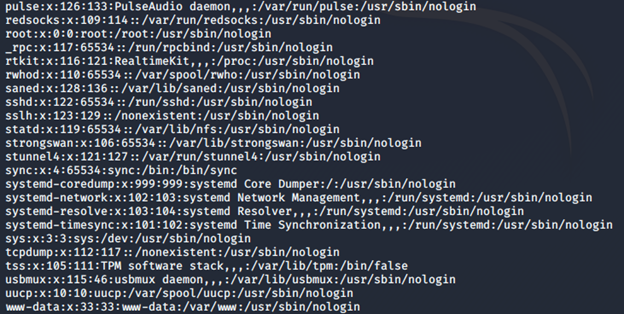
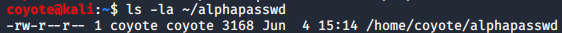

### 3.2.5.1 Exercises
#### 1. Use the cat command in conjunction with sort to reorder the content of the /etc/passwd file on your Kali Linux system.

```bash
cat /etc/passwd | sort -d
```



#### 2. Redirect the output of the previous exercise to a file of your choice in your home directory.

```bash
cat /etc/passwd | sort -d > ~/alphapasswd
```

