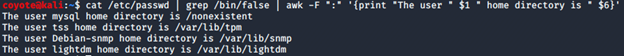

### 3.3.5.1 Exercises
#### 1. Using /etc/passwd, extract the user and home directory fields for all users on your Kali machine for which the shell is set to /bin/false. Make sure you use a Bash one-liner to print the output to the screen. The output should look similar to Listing 53 below:

```bash
cat /etc/passwd | grep /bin/false | awk -F ":" '{print "The user " $1 " home directory is " $6}'
```



#### 2. Copy the /etc/passwd file to your home directory (/home/kali).

```bash
cp /etc/passwd ~
```

#### 3. Use cat in a one-liner to print the output of the /kali/passwd and replace all instances of the “Gnome Display Manager” string with “GDM”

*Note:  Using 'Light Display Manager' instead of Gnome, per this forum post: https://forums.offensive-security.com/showthread.php?28145-Exercise-3-3-5-1-problem-on-2020-1-VM&highlight=gnome+display+manager*

```bash
cat ./passwd | sed 's/Light Display Manager/LDM/'
```

