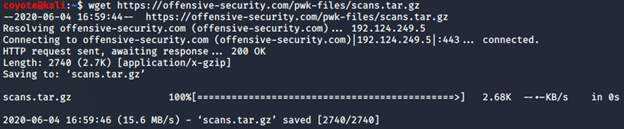

### 3.5.3.1 Exercises
#### 1. Download the archive from the following URL https://offensive-security.com/pwkfiles/scans.tar.gz

#### 2. This archive contains the results of scanning the same target machine at different times. Extract the archive and see if you can spot the differences by diffing the scans.

- 10.11.1.118_scan* files
  - 2nd scan taken 6 minutes after first
  - Seems that host was down during first scan but up during second scan, therefore 2nd scan contains open ports on host while first scan doesn't.
- 10.11.1.234_scan_* files_
  - Scans taken 2 minutes apart
  - An additional port was open during second scan (1337)
  - Some other minor differences with number of closed/filtered ports
- 10.11.1.8_scan* files
  - Scans taken 10 minutes apart
  - Some ports were closed on the host during the second scan (80,443,3306)
  - Some other minor differences with number of closed/filtered ports