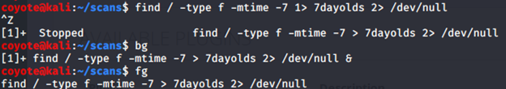
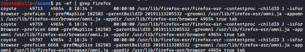
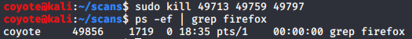

### 3.6.3.1 Exercises
#### 1. Find files that have changed on your Kali virtual machine within the past 7 days by running a specific command in the background.

```bash
find / -type f -mtime -7 1> 7dayolds 2> /dev/null &
```

#### 2. Re-run the previous command and suspend it; once suspended, background it.

```bash
find / -type f -mtime -7 1> 7dayolds 2> /dev/null
CTRL+Z
bg
```


#### 3. Bring the previous background job into the foreground.

```bash
fg
```



#### 4. Start the Firefox browser on your Kali system. Use ps and grep to identify Firefox’s PID.

```bash
firefox &
ps -ef | grep firefox
```



#### 5. Terminate Firefox from the command line using its PID.

```bash
sudo kill 49713 49759 49797
```

