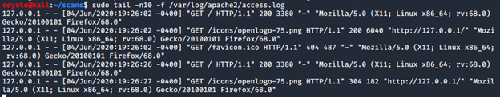
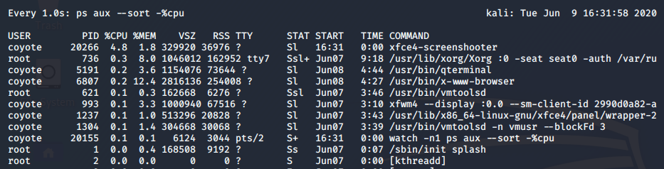

### 3.7.2.1 Exercises
#### 1. Start your apache2 web service and access it locally while monitoring its access.log file in real-time.

```bash
sudo systemctl start apache2
sudo tail -n10 -f /var/log/apache2/access.log
```



#### 2. Use a combination of watch and ps to monitor the most CPU-intensive processes on your Kali machine in a terminal window; launch different applications to see how the list changes in real time.

```bash
watch -n1 ps aux --sort -%cpu
```

