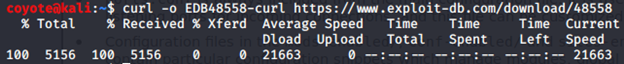
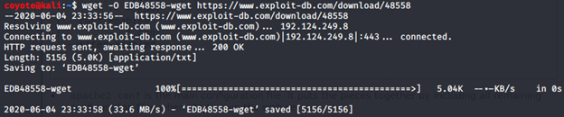
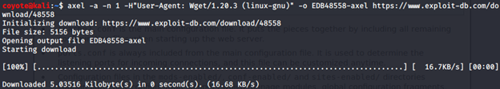

### 3.8.3.1 Exercise
#### Download the PoC code for an exploit from https://www.exploit-db.com using curl, wget, and axel, saving each download with a different name.

- curl

  ```bash
  curl -o EDB48558-curl https://www.exploit-db.com/download/48558
  ```

  

- wget

  ```bash
  wget -O EDB48558-wget https://www.exploit-db.com/download/48558
  ```

  

- axel
  *Note: I had to specify the user-agent because EDB was blocking axel otherwise, per this post: https://forums.offensive-security.com/showthread.php?28183-Exercice-3-8-3-1&highlight=axel+403*

  ```bash
  axel -a -n 1 -H"User-Agent: Wget/1.20.3 (linux-gnu)" -o EDB48558-axel https://www.exploit-db.com/download/48558
  ```

  