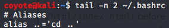
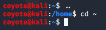
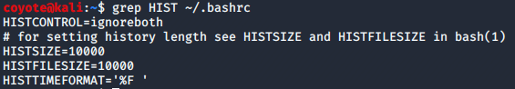
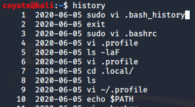

### 3.9.3.1 Exercises
#### 1. Create an alias named “..” to change to the parent directory and make it persistent across terminal sessions.

#### 2. Permanently configure the history command to store 10000 entries and include the full date in its output.

