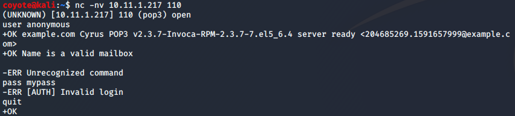
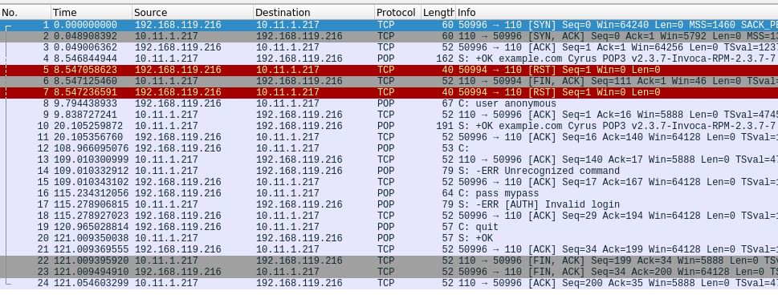
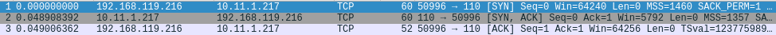
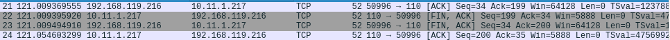
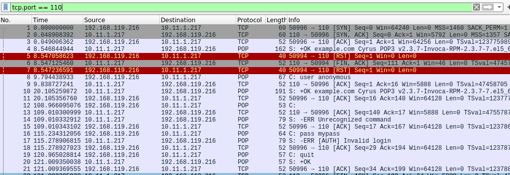
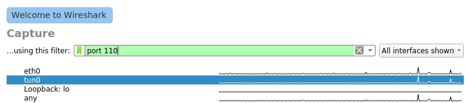
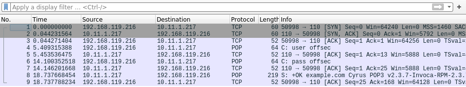

### 4.4.5.1 Exercises
#### 1. Use Wireshark to capture network activity while attempting to connect to 10.11.1.217 on port 110 using Netcat, and then attempt to log into it.

#### 2. Read and understand the output. Where is the three-way handshake happening? Where is the connection closed?

- 3-Way Handshake
  
- Connection Close
  

#### 3. Follow the TCP stream to read the login attempt.

#### 4. Use the display filter to only monitor traffic on port 110.

#### 5. Run a new session, this time using the capture filter to only collect traffic on port 110.

