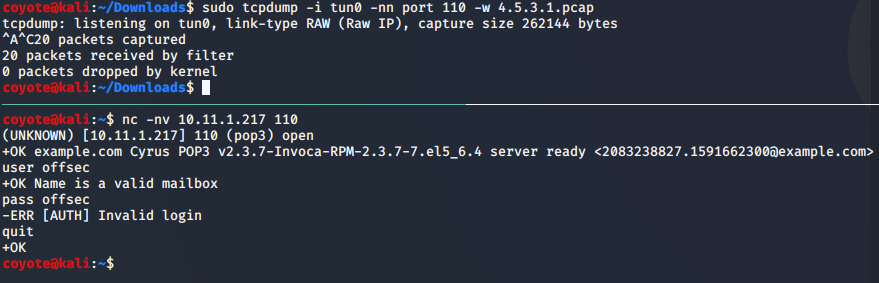
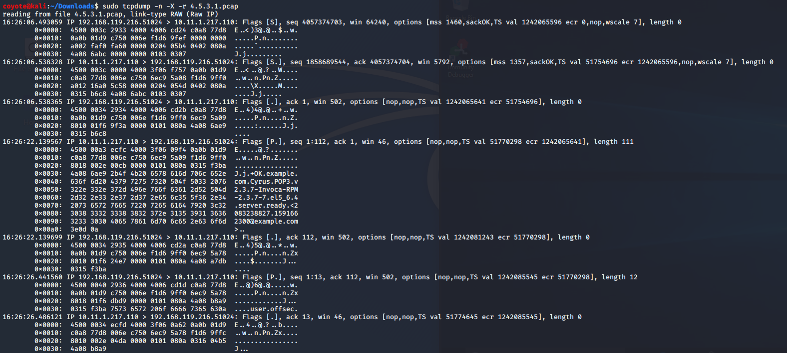
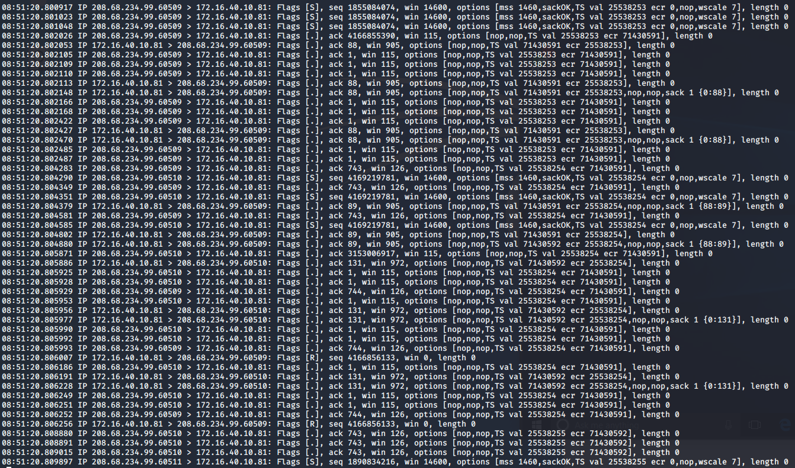

### 4.5.3.1 Exercises
#### 1. Use tcpdump to recreate the Wireshark exercise of capturing traffic on port 110.

```bash
sudo tcpdump -i tun0 -nn port 110 -w 4.5.3.1.pcap
```



#### 2. Use the -X flag to view the content of the packet. If data is truncated, investigate how the -s flag might help.

```bash
sudo tcpdump -n -X -r 4.5.3.1.pcap
```



My capture was not truncated, but -s (snaplen) allows you to specify the length of data to capture, which defaults to 262144 bytes.

#### 3. Find all ‘SYN’, ‘ACK’, and ‘RST’ packets in the password_cracking_filtered.pcap file.

```bash
sudo tcpdump -n 'tcp[13] = 2' or 'tcp[13] = 4' or 'tcp[13] = 16' -r password_cracking_filtered.pcap
```



#### 4. An alternative syntax is available in tcpdump where you can use a more user-friendly filter to display only ACK and PSH packets. Explore this syntax in the tcpdump manual by searching for “tcpflags”. Come up with an equivalent display filter using this syntax to filter ACK and PSH packets.

```bash
sudo tcpdump -n 'tcp[tcpflags] & tcp-push != 0 && tcp-ack != 0' -r password_cracking_filtered.pcap
```

