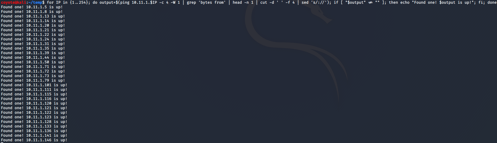
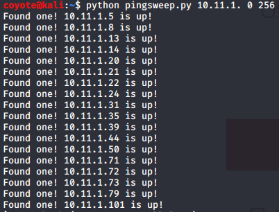
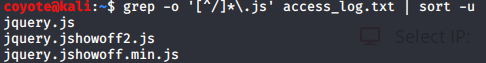
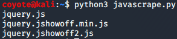

### 5.7.3.1 Exercises
#### 1. Research Bash loops and write a short script to perform a ping sweep of your target IP range of 10.11.1.0/24.

```bash
for IP in {1..254}; do output=$(ping 10.11.1.$IP -c 4 -W 1 | grep 'bytes from' | head -n 1 | cut -d ' ' -f 4 | sed 's/://'); if [ "$output" != "" ]; then echo "Found one! $output is up!"; fi; done
```



#### 2. Try to do the above exercise with a higher-level scripting language such as Python, Perl, or Ruby.

It only works on /24's but the arguments are the first 3 octets of the network ending with a period (10.11.1.), the first and then last IP in the 4th octet that you wish to scan.

Code:

```python
# Python Code
import subprocess, sys

for i in range(int(sys.argv[2]),int(sys.argv[3])+1):
  IP=sys.argv[1] + str(i)
  p = subprocess.Popen(["ping","-c 1","-W 1",IP], stdout=subprocess.PIPE)
  output, err = p.communicate()
  if ("bytes from" in output):
    print("Found one! " + IP +" is up!")
```

```python
python pingsweep.py 10.11.1. 0 254
```



#### 3. Use the practical examples in this module to help you create a Bash script that extracts JavaScript files from the access_log.txt file (http://www.offensive-security.com/pwk-files/access_log.txt.gz). Make sure the file names DO NOT include the path, are unique, and are sorted.

```bash
grep -o '[^/]*\.js' access_log.txt | sort -u
```

#### 

#### 4. Re-write the previous exercise in another language such as Python, Perl, or Ruby.

```python
# Python Code
import re

with open('access_log.txt') as fp:
  # Read entire contents to a string
  contents=fp.read()
  # Search string & produce iterator of re.Match objects
  results=re.finditer(r"[^/]*\.js", contents)
  # Iterate through the results & return unique matching strings
  matchstr=[]
  for i in results:
    if i.group(0) not in matchstr:
      matchstr.append(i.group(0))
  # Sort the list
  matchstr=sorted(matchstr)
  # Print the list in single-column format
  for i in matchstr:
    print(i)
```



