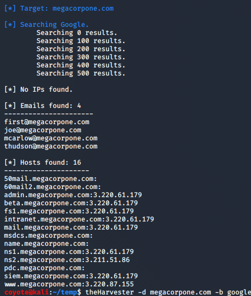
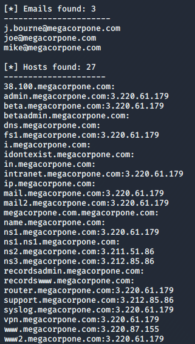

### 6.12.1.1 Exercises
#### 1. Use theHarvester to enumerate emails addresses for megacorpone.com.

`theharvester` was a deprecated command.

```bash
theHarvester -d megacorpone.com -b google
```



#### 2. Experiment with different data sources (-b). Which ones work best for you?

- duckduckgo - no hits  <-------Trash!!
- Google - 4 emails/16 hosts  <-----2nd Place!
- Baidu - 4 hosts  <----3rd place!
- github-code - 3 emails, 27 hosts  <----Winner!

