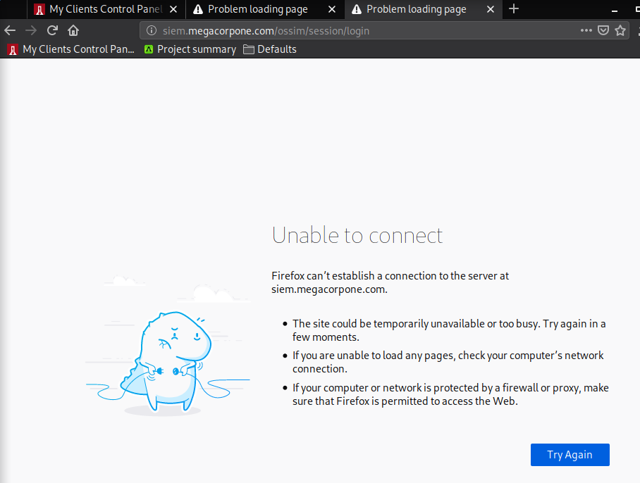
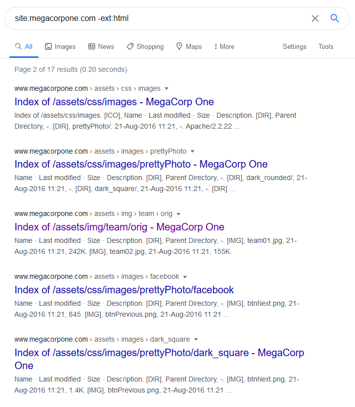
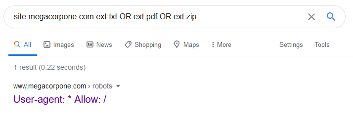

### 6.4.1.1 Exercises
#### 1. Who is the VP of Legal for MegaCorp One and what is their email address?

Name: Mike Carlow
Title: VP Of Legal
Email: mcarlow@megacorpone.com 

#### 2. Use Google dorks (either your own or any from the GHDB) to search www.megacorpone.com for interesting documents.

It appears the items that were supposed to show up are no longer available.  I checked the forums and others were having the same issue.  See:  https://forums.offensive-security.com/showthread.php?29855-6-4-1-1-Exercise-2&highlight=google+dorks



This was evident when the examples in the course document were also not getting the same results as shown in the course document.  However, I did try some searches anyway:

```bash
site:megacorpone.com -ext:html
```



```bash
site:megacorpone.com ext:txt OR ext:pdf OR ext:zip
```



#### 3. What other MegaCorp One employees can you identify that are not listed on www.megacorpone.com?

From: https://rocketreach.co/?tags=!((incexc:include,keyword:megacorpone.com,type:keywords))&page_size=10&start=1&mode=default

- Fred Ducasse
  Title: Investments
  Email: fred@megacorpone.com
- Name: Mike Schneakins
  Title: Software Developer
  Email: mike@megacorpone.com
- Stan Denvers
  Title:  Collections
- Handy KcKay
  Title: Recruiter

```bash
# Google Search
@megacorpone.com -site:megacorpone.com
```

- William Adler
  Title: Intern
  Twitter:  @RealWillAdler (with password on post-it)
- Fred Godden

