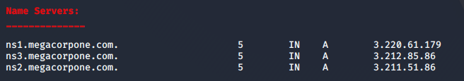
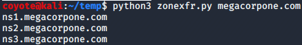
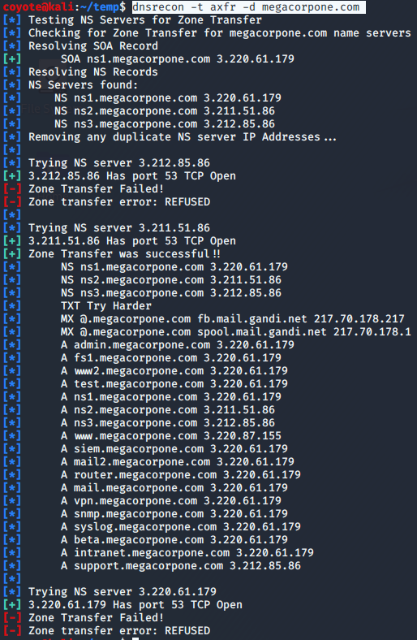

### 7.1.6.3 Exercises
#### 1. Find the DNS servers for the megacorpone.com domain.

```bash
dnsenum megacorpone.com
```



#### 2. Write a small script to attempt a zone transfer from megacorpone.com using a higher-level scripting language such as Python, Perl, or Ruby.

```python
import re, sys, subprocess

dns=subprocess.run(["host","-t","ns",sys.argv[1]],stdout=subprocess.PIPE)
results=re.findall(r"\w*\.\w*\.\w*", str(dns.stdout))
for i in results:
 print(i)
```



#### 3. Recreate the example above and use dnsrecon to attempt a zone transfer from megacorpone.com.

```bash
dnsrecon -t axfr -d megacorpone.com
```

