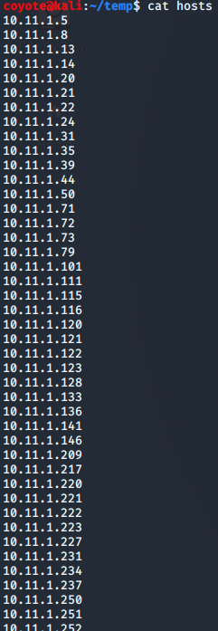
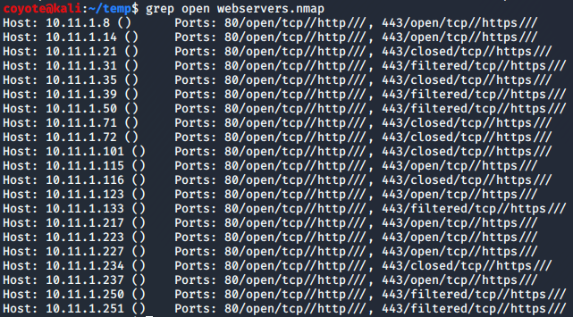
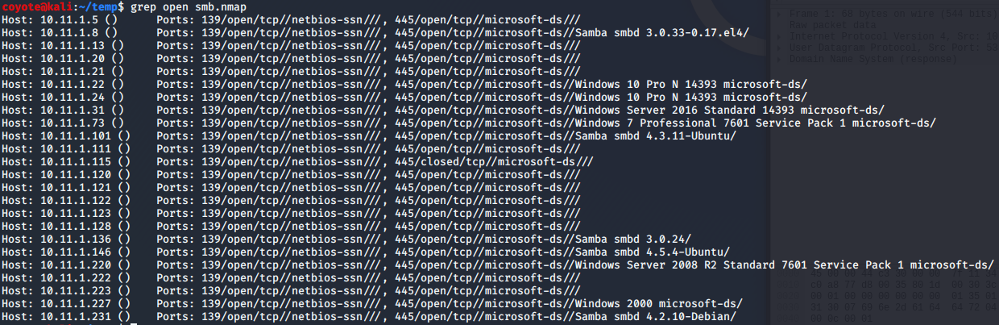
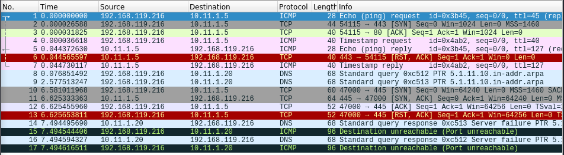
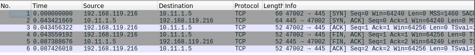
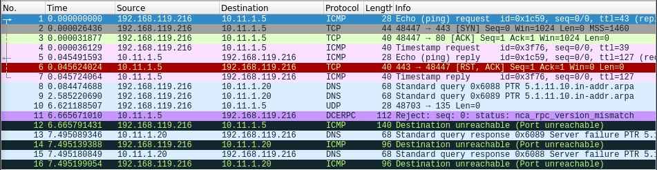
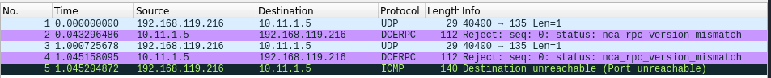
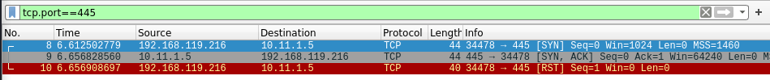
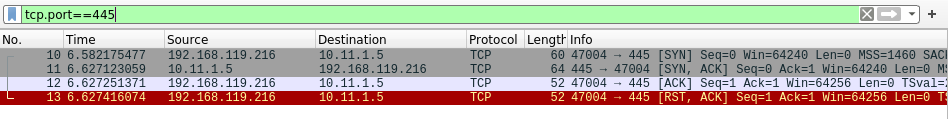

### 7.2.2.9 Exercises
#### 1. Use Nmap to conduct a ping sweep of your target IP range and save the output to a file. Use grep to show machines that are online.

```bash
sudo nmap -sP 10.11.1.0/24 -oG pingsweep
grep Up pingsweep | cut -d " " -f 2 > hosts
cat hosts
```



#### 2. Scan the IP addresses you found in exercise 1 for open webserver ports. Use Nmap to find the webserver and operating system versions.

```bash
sudo nmap -p80,443 -sT -iL hosts -oG webservers.nmap
grep open webservers.nmap
```



#### 3. Use NSE scripts to scan the machines in the labs that are running the SMB service.

```bash
sudo nmap -p139,445 -script=smb-os-discovery -sT -iL hosts -oG smb.nmap
grep open smb.nmap
```



#### 4. Use Wireshark to capture a Nmap connect and UDP scan and compare it against the Netcat port scans. Are they the same or different?

Connect Scan

- Nmap

  ```bash
  sudo nmap -sT -p445 10.11.1.5
  ```

  

- Netcat

  ```bash
  nc -nvz -w 1 10.11.1.5 445
  ```

  

UDP Scan

- Nmap

  ```bash
  sudo nmap -p135 -sU 10.11.1.5
  ```

  

- Netcat

  ```bash
  nc -nvz -w 1 -u 10.11.1.5 135
  ```

  

For both TCP and UDP, the Netcat scans send far fewer packets to the target, due to the extra querying that nmap performs.

#### 5. Use Wireshark to capture a Nmap SYN scan and compare it to a connect scan and identify the difference between them.

- SYN Scan

  ```bash
  sudo nmap -sS -p445 10.11.1.5
  ```

  

- Connect Scan

  ```bash
  sudo nmap -sT -p445 10.11.1.5
  ```

  

The main difference is with the SYN scan, the nmap sends a RST once it receives a SYN-ACK from the target to close the connection, without completing the 3-way handshake.  With a Connect scan, nmap completes the 3-way handshake and then immediately sends a RST-ACK to close the connection.