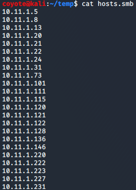
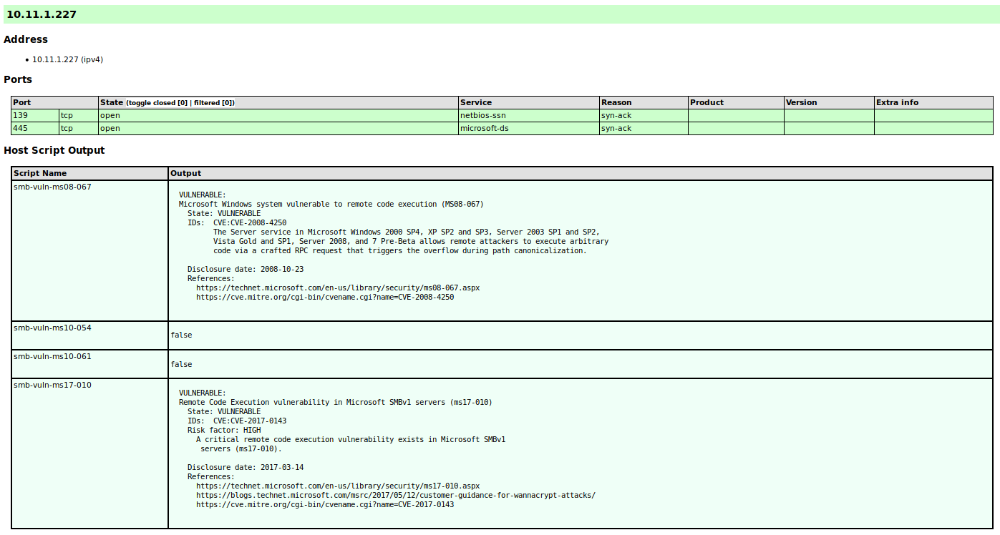
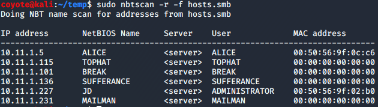
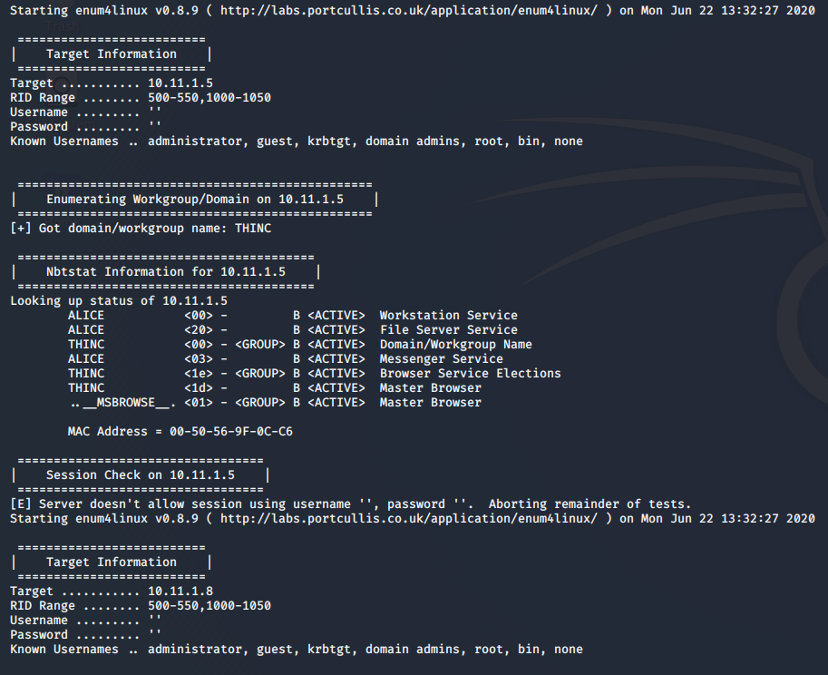

### 7.3.2.1 Exercises
#### 1. Use Nmap to make a list of the SMB servers in the lab that are running Windows.

```bash
sudo nmap -v -p 139,445 -oG nmap.smb 10.11.1.1-254
grep open nmap.smb | cut -d " " -f 2 > hosts.smb
cat hosts.smb
```



#### 2. Use NSE scripts to scan these systems for SMB vulnerabilities.

```bash
nmap -v -p 139,445 --script=smb-vuln* -iL hosts.smb -oA nmap.smb.vuln
xsltproc nmap.smb.vuln.xml -o nmap.html
firefox nmap.html &
```

Example output:



#### 3. Use nbtscan and enum4linux against these systems to identify the types of data you can obtain from different versions of Windows.

- nbtscan
  
  ```bash
  sudo nbtscan -r -f hosts.smb
  ```
  
  
  
- enum4linux

  ```bash
  for i in $(cat hosts.smb); do enum4linux -a $i; done > enum4linux.smb
  less enum4linux.smb
```
  
Example:
  

  
  
  