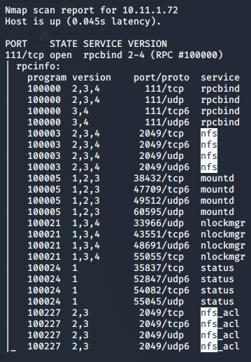
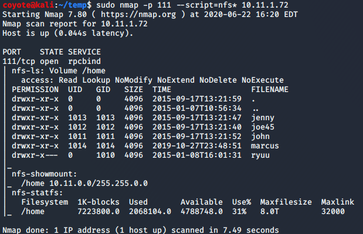

### 7.4.2.1 Exercises
#### 1. Use Nmap to make a list of machines running NFS in the labs.

```bash
nmap -v -sV -p 111 --script=rpcinfo 10.11.1.1-254 -oA nmap.nfs
less nmap.nfs.nmap
```



#### 2. Use NSE scripts to scan these systems and collect additional information about accessible shares.

```bash
sudo nmap -p 111 --script=nfs* 10.11.1.72
```

