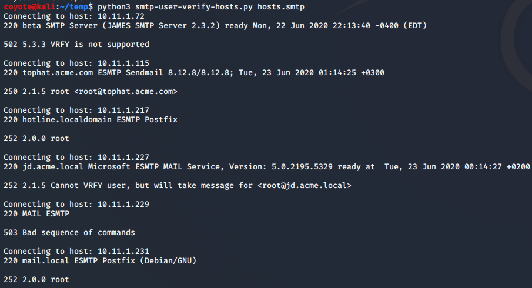
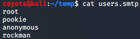
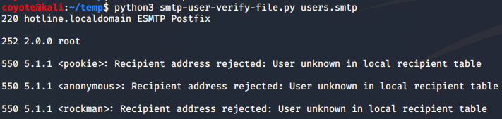

### 7.5.1.1 Exercises
#### 1. Search your target network range to see if you can identify any systems that respond to the SMTP VRFY command.

```bash
nmap -p 25 10.11.1.0/24 -oG nmap.smtp
grep open nmap.smtp | cut -d " " -f 2 > hosts.smtp
```

```python
#!/usr/bin/python
# smtp-user-verify-hosts.py 
import socket
import sys
if len(sys.argv) != 2:
 print("Usage: vrfy.py <hostfile>")
 sys.exit(0)
with open(sys.argv[1].encode()) as hostlist:
    for host in hostlist:
        # Create a Socket
        s = socket.socket(socket.AF_INET, socket.SOCK_STREAM)
        # Strip trailing newline
        host=host.rstrip('\n')
        print("Connecting to host: " + host)
        # Connect to the Server
        connect = s.connect((host,25))
        # Receive the banner
        banner = s.recv(1024)
        print(banner.decode())
        # VRFY a user  
        s.send(b'VRFY root \r\n')
        result = s.recv(1024)
        print(result.decode())
        # Close the socket
        s.close()
```

```bash
python3 smtp-user-verify-hosts.py hosts.smtp
```



- Systems supporting VRFY:
  - 10.11.1.115
  - 10.11.1.217
  - 10.11.1.227
  - 10.11.1.231

#### 2. Try using this Python code to automate the process of username discovery using a text file with usernames as input.

```python
#!/usr/bin/python
# smtp-user-verify-file.py
import socket
import sys
if len(sys.argv) != 2:
  print("Usage: vrfy.py <filename>")
  sys.exit(0)
# Create a Socket
s = socket.socket(socket.AF_INET, socket.SOCK_STREAM)
# Connect to the Server
connect = s.connect(('10.11.1.217',25))
# Receive the banner
banner = s.recv(1024)
print(banner.decode())
with open(sys.argv[1].encode()) as userlist:
  for user in userlist:
    # Strip trailing newline
    user=user.rstrip('\n')
    # VRFY a user
    s.send(b'VRFY ' + user.encode() + b'\r\n')
    result = s.recv(1024)
    print(result.decode())
# Close the socket
s.close()
```

```python
cat users.smtp
```



```python
python3 smtp-user-verify-file.py users.smtp
```



