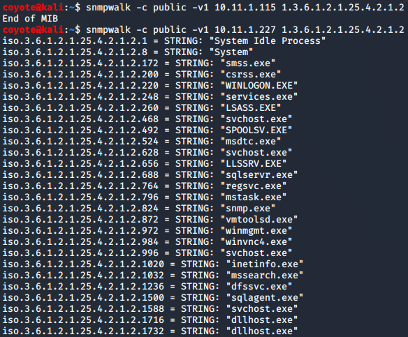
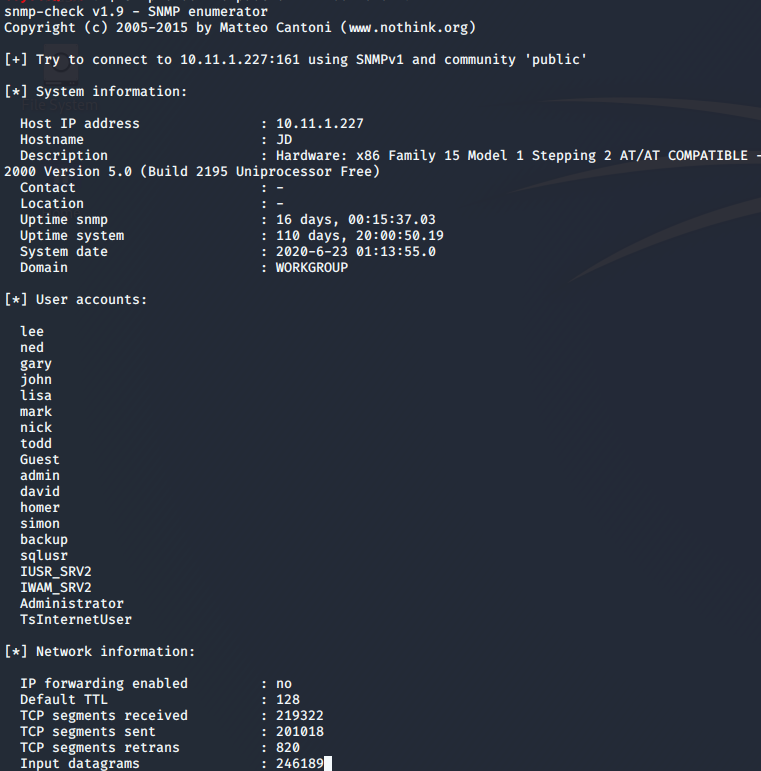
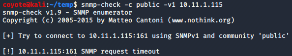

### 7.6.3.6 Exercises
#### 1. Scan your target network with onesixtyone to identify any SNMP servers.

```bash
echo public > community
echo private >> community
echo manager >> community
for ip in $(seq 1 254); do echo 10.11.1.$ip; done > hosts
onesixtyone -c community -i hosts
```


#### 2. Use snmpwalk and snmp-check to gather information about the discovered targets.

- snmpwalk
  
  
- snmp-check
  
  ```bash
  snmp-check -c public -v1 10.11.1.227
  ```
  
  
  
  ```bash
  snmp-check -c public -v1 10.11.1.115
  ```
  
  

