### 8.2.4.2 Exercises
#### 1. Follow the steps above to create your own unauthenticated scan of Gamma.

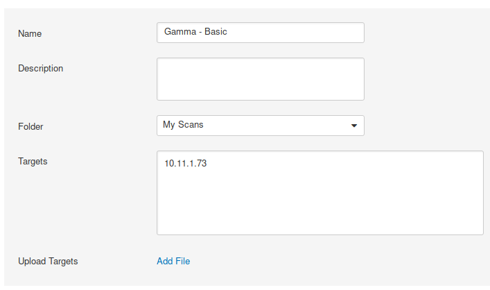

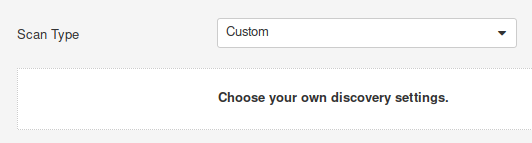

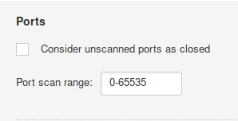

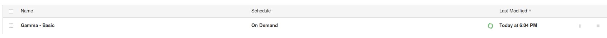

#### 2. Run the scan with Wireshark open and identify the steps the scanner performed to completed the scan.

- Host Discovery
  - SNMP get-next-request 1.3.6.1.2.1.1.1.0 (sysdescr?)
  - Pings host
    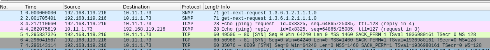
- Port Scan
  - Connect Scan on common ports (80, 22, 445, etc.)
    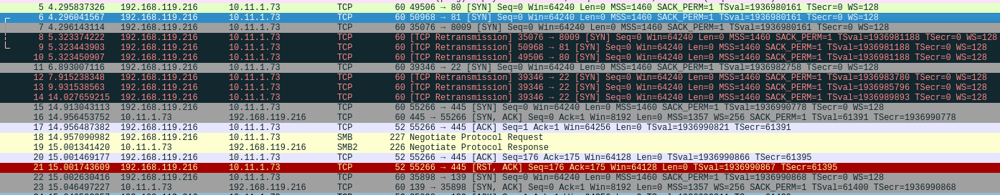
  - Does a SYN scan on remaining ports
    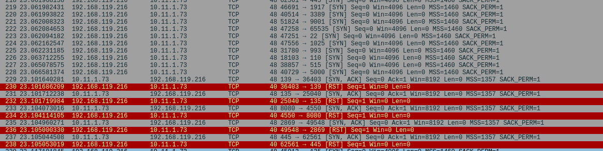
- Enumeration
  - Runs RPC EPM (Endpoint Mapping) commands
    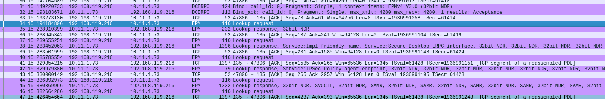
  - Runs SMB commands
    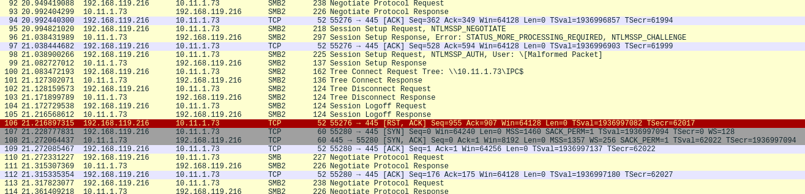
- Vulnerability Scan
  - Scans ports it found.
    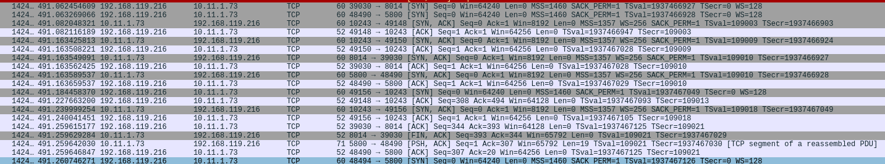
  - Runs a vulnerability scan on the webserver
    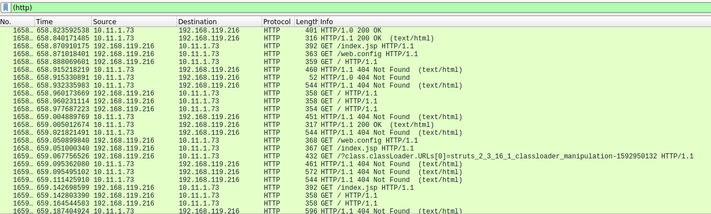

#### 3. Review the results of the scan.

Grouped results:

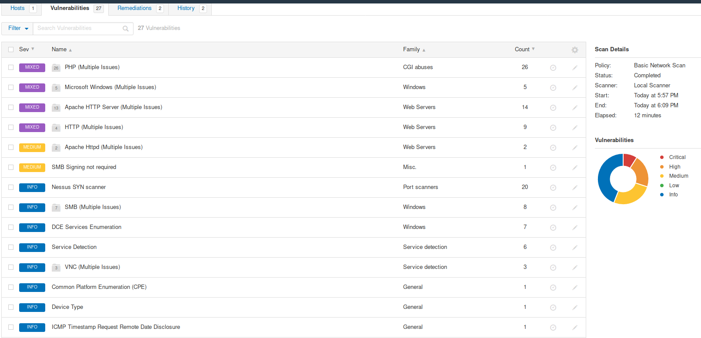

Groups disabled: 

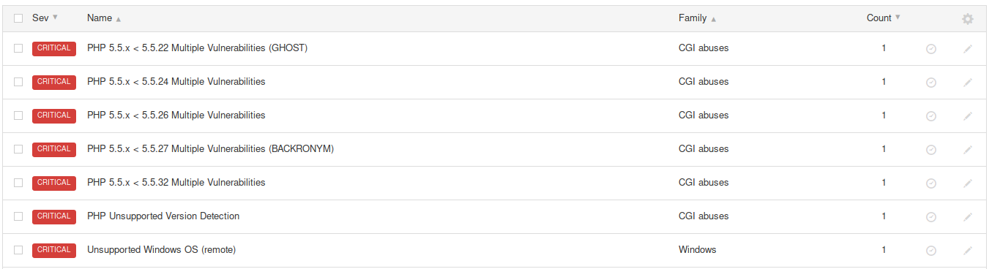