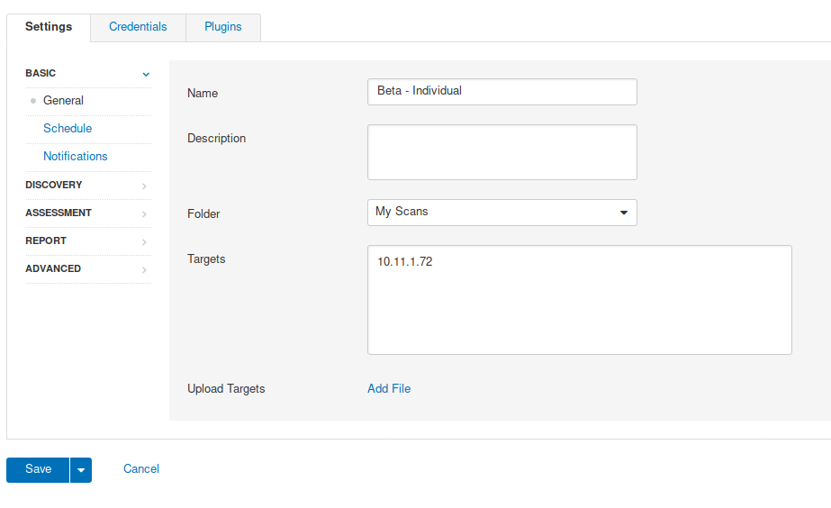
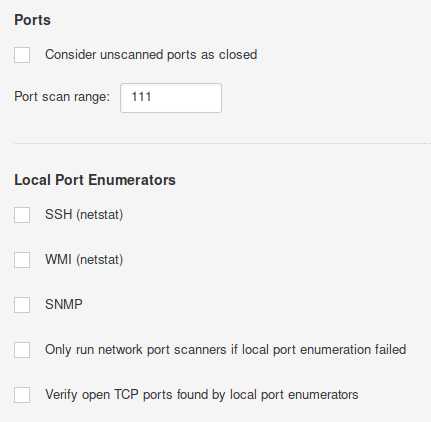
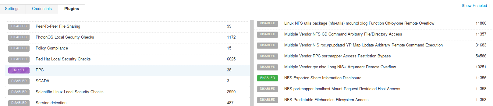
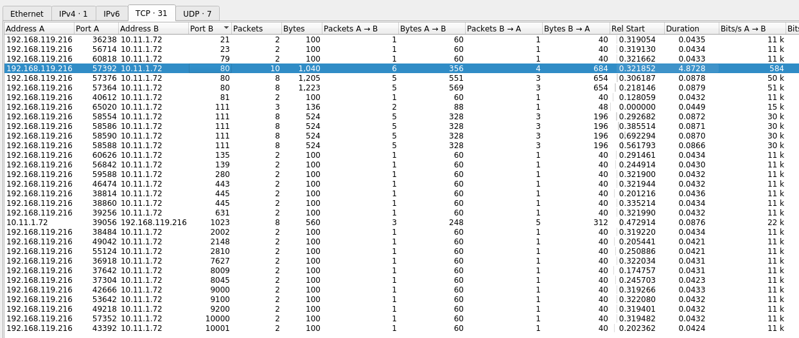
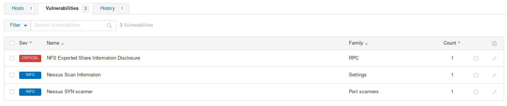

### 8.2.6.1 Exercises
#### 1. Follow the steps above to create your own individual scan of Beta.

#### 2. Run Wireshark or tcpdump during the individual scan. What other ports does Nessus scan? Why do you think Nessus scans other ports?

"This happens because port scanning is only one part of Nessus’s scanning profile and most vulnerability scanners run additional services and plugins to gather target information behind the scenes."

#### 3. Review the results of the scan.

