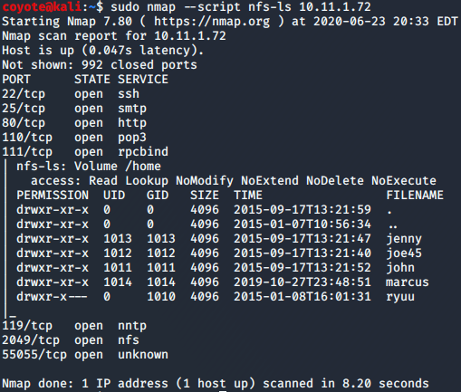

### 8.3.1.1 Exercise
#### 1. Find an NSE script similar to the NFS Exported Share Information Disclosure that was executed in the “Scanning with Individual Nessus Plugins” section. Once found, run the script against Beta in the PWK labs

````bash
ls /usr/share/nmap/scripts/*nfs*
sudo nmap --script nfs-ls 10.11.1.72
````

