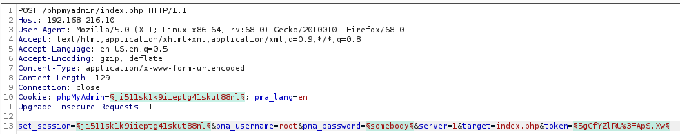
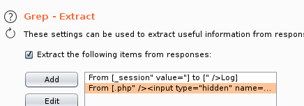
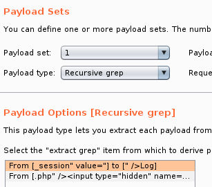
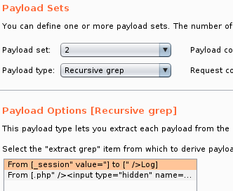
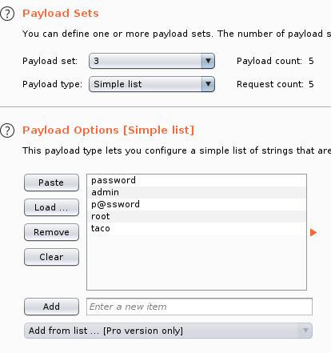
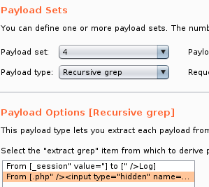
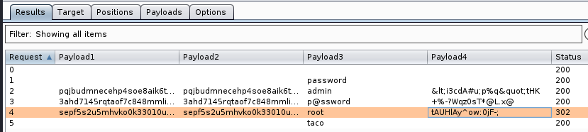
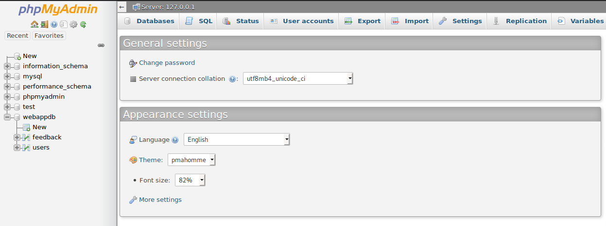
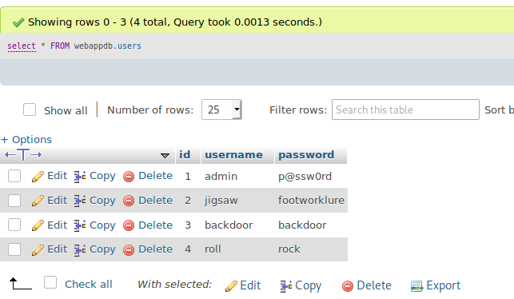

### 9.4.1.3 Exercises
#### 1. Use Burp Intruder to gain access to the phpMyAdmin site running on your Windows 10 lab machine.

- Positions
  

- Grep Extracts
  

- Payloads
  

  
  

  

- Attack Results
  

- Pwned
  

#### 2. Insert a new user into the “users” table.

```sql
INSERT INTO webappdb.users(password,username) VALUES ("rock","roll")
select * FROM webappdb.users
```

